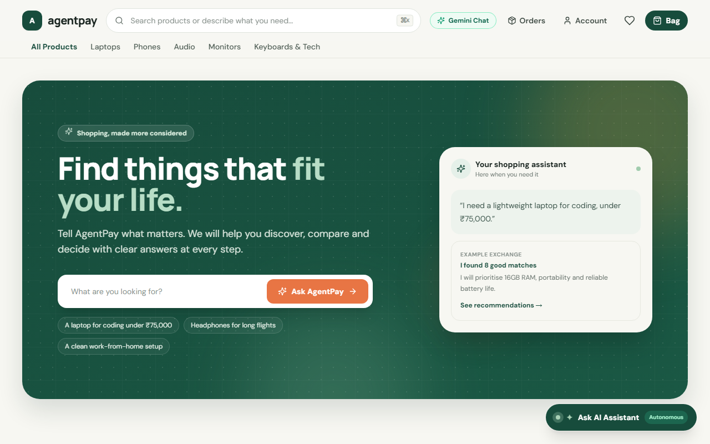
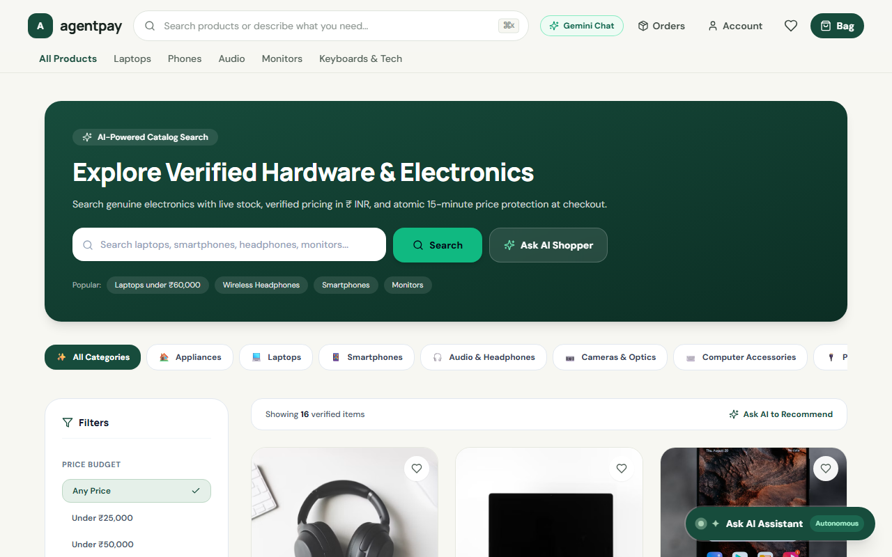
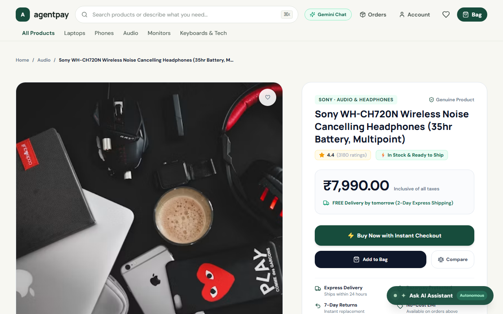
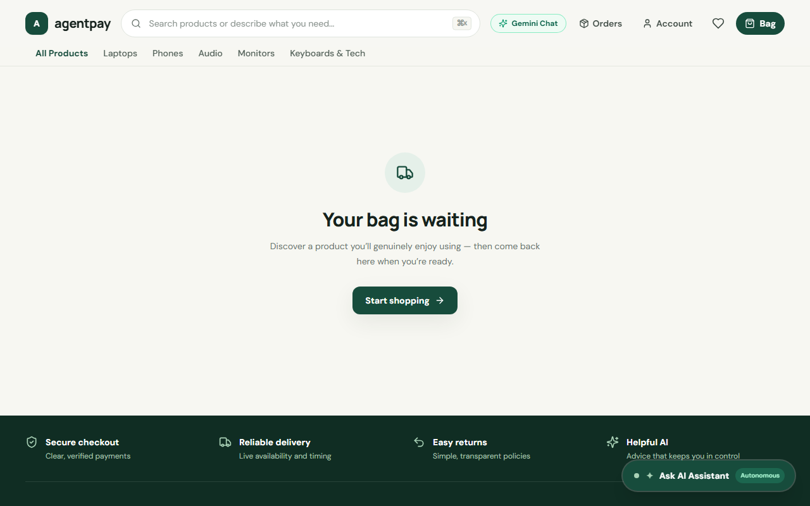
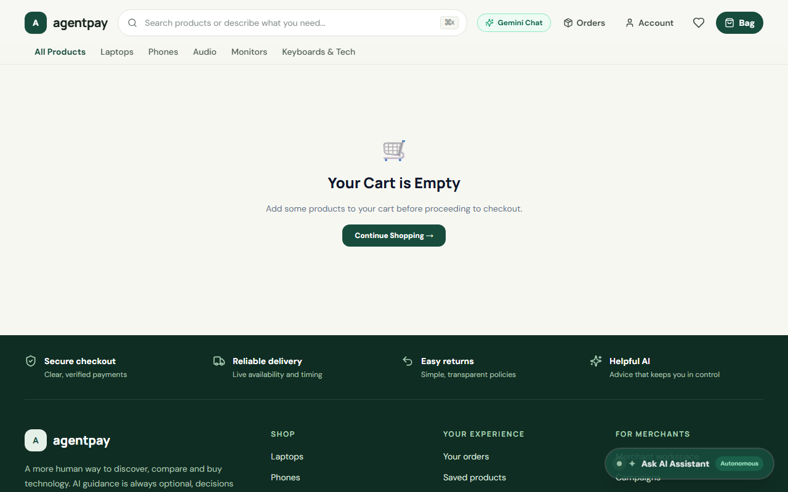
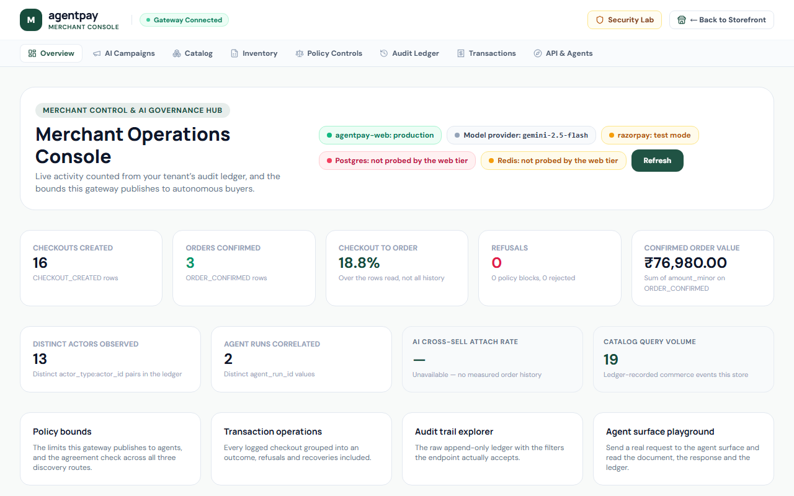
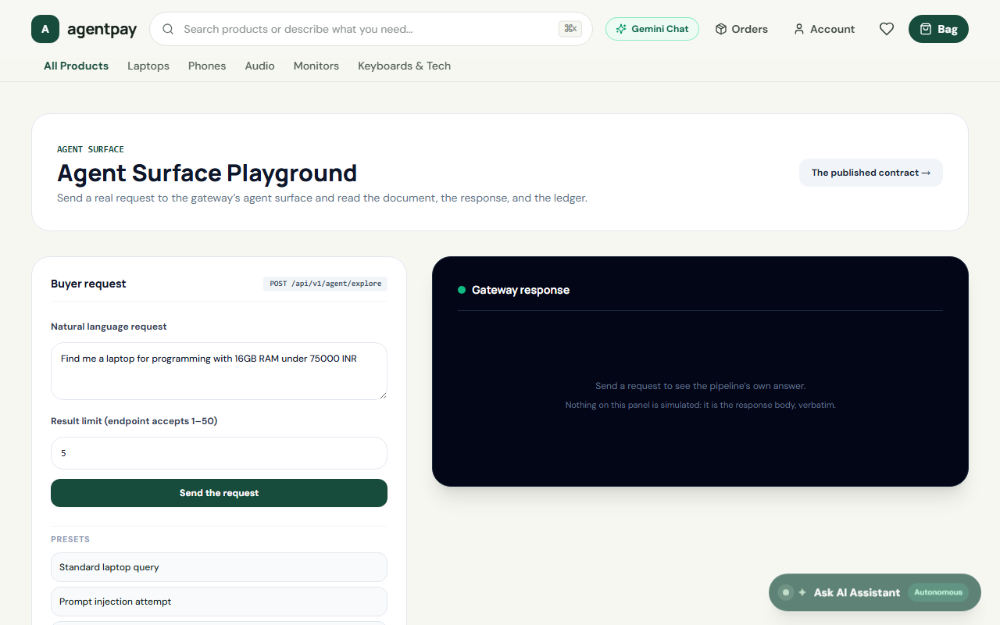
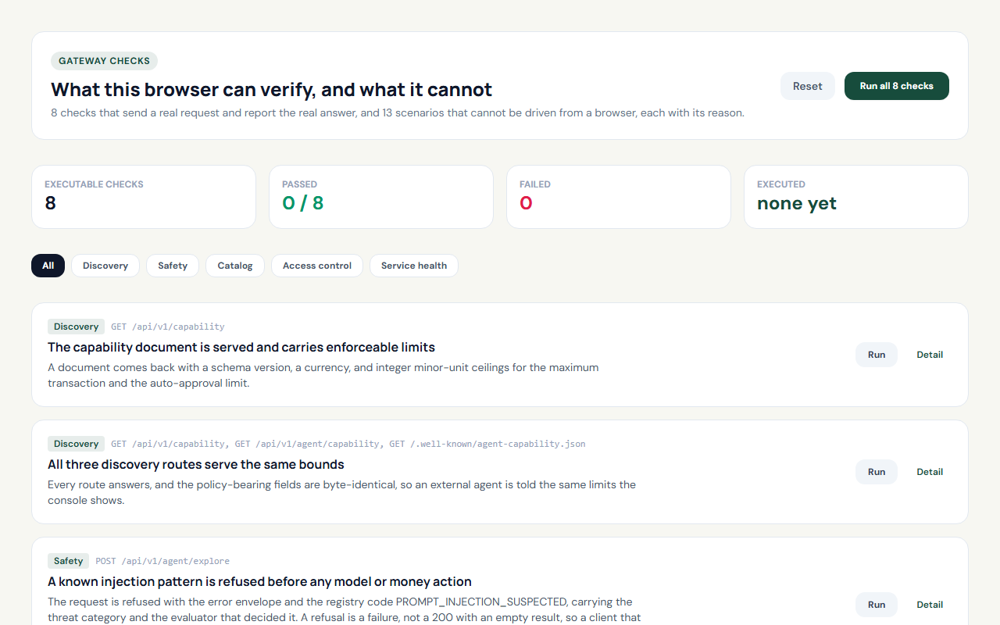
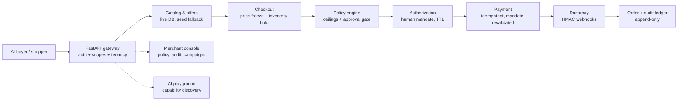

# 🛡️ AgentPay — Autonomous Agentic Commerce Gateway
### *Making Merchants Discoverable, Sellable, and Transactable to AI Buyers on Razorpay*

<p align="center">
  <a href="https://github.com/ABHISHEK1139/AI-Growth-Agentic-Commerce">
    
  </a>
  <a href="https://github.com/ABHISHEK1139/AI-Growth-Agentic-Commerce/forks">
    
  </a>
  <a href="https://github.com/ABHISHEK1139/AI-Growth-Agentic-Commerce/watchers">
    
  </a>
  <a href="https://github.com/ABHISHEK1139/AI-Growth-Agentic-Commerce/commits/main">
    
  </a>
  <a href="https://github.com/ABHISHEK1139/AI-Growth-Agentic-Commerce">
    
  </a>
</p>

<p align="center">
  <a href="https://github.com/ABHISHEK1139/AI-Growth-Agentic-Commerce"><strong>Source, issues and releases → github.com/ABHISHEK1139/AI-Growth-Agentic-Commerce</strong></a>
</p>

[](https://github.com/ABHISHEK1139/AI-Growth-Agentic-Commerce)
[-black?style=for-the-badge&logo=next.js)](https://nextjs.org)
[](https://fastapi.tiangolo.com)
[](https://razorpay.com)
[](https://pytest.org)
[](https://docs.astral.sh/ruff)
[](https://mypy-lang.org)
[](https://www.typescriptlang.org)
[](#)

---

## ✨ Why this project is worth a look

Most agentic-commerce demos stop at "the AI can find a product." AgentPay is built around
the part that is actually hard — **an AI that can spend someone's money**, which means
every action has to be bounded, priced, and provable afterwards.

| | |
|---|---|
| 🤖 **Real autonomous buyer, not a chatbot** | A standalone agent (`buyer-agent/`) uses only the public API — exactly as an external integrator would — to search priced offers, create a checkout (which reserves inventory atomically), request human authorization bound to a price hash, and initiate a payment against Razorpay. |
| 🔐 **Money movement fails closed** | Payments are HMAC-verified *and* re-fetched from the provider (exact amount, currency, capture) before anything is confirmed. Unknown payments 404 rather than minting phantom orders. |
| 🧾 **Append-only audit ledger** | Every agent action, policy decision and money movement is recorded with correlation IDs, actor, reason code and model version. It is the record, not a byproduct. |
| 🔒 **Tenant isolation enforced in the data layer** | A scoped repository **refuses to execute** a query that carries no tenant filter, so an unscoped read is a crash rather than a leak. A cross-tenant write raises `CrossTenantWriteError`; a scoped read for someone else's row simply finds nothing and the endpoint answers *not found*. |
| 🧱 **Architecture boundaries in CI** | Four `lint-imports` contracts keep the agent layer away from the database, keep domain services out of the delivery layer, and stop the pipeline importing domain code. Breaks fail the build. |
| 🔁 **Replay-safe webhooks** | Signature verification, deterministic event IDs and deduplication mean a provider retry storm cannot double-charge or silently swallow a captured payment. |
| 📏 **Throughput is measured, not estimated** | A k6 harness with a seeded fixture reports a capacity ladder — currently ~500 req/s clean on a 2-worker container. The first estimate was wrong by 3.5×; measuring it is how that was found. |
| 🧭 **Schema drift cannot hide** | An integration test compares the ORM against the live database on every mapped table, because a suite that builds its tables *from* the ORM cannot detect them disagreeing. |

**Verification:** 1,968 unit/security/contract tests · 64 integration tests against live
PostgreSQL and Redis · 30 browser end-to-end specs · ruff, mypy, tsc and all four
architecture contracts. Every fix in recent history carries a test verified to fail when
the fix is reverted.

> Full production-readiness analysis, including measured capacity and the honest
> remaining gaps, is in [`docs/production/READINESS_PLAN.md`](docs/production/READINESS_PLAN.md)
> and [`docs/production/capacity-report.md`](docs/production/capacity-report.md).

---

## 📸 Product Tour (real screenshots, local dev server)

| Shopper storefront | AI search | Product page |
|---|---|---|
|  |  |  |

| Bag & gated checkout | Merchant console | Agent playground |
|---|---|---|
|  |  |  |

<p align="center">
  
  
</p>

---

## 🗺️ How a payment flows



---

## 🛡️ Executive Summary & About AgentPay

**AgentPay is an autonomous agentic commerce gateway built on Razorpay that makes merchants discoverable, sellable, and transactable to AI-powered buyers.**

As AI agents evolve from systems that simply answer questions into systems that can **discover products, compare options, make decisions, and complete purchases**, traditional e-commerce infrastructure faces a major challenge: most online stores are designed for human shoppers, not autonomous AI buyers.

AgentPay addresses this gap by providing a **merchant-side AI commerce gateway** that connects intelligent agents with real commerce infrastructure while keeping every financial action strictly bounded and auditable.

The platform has two core objectives:

---

### 🤖 1. Make Commerce Accessible to AI Buyers

AgentPay allows external autonomous AI agents to interact with a merchant's catalog and commerce APIs programmatically.

It provides:

* **Machine-readable commerce discovery** through `/.well-known/agent-commerce` and `/.well-known/agent-capability.json`
* **Scoped authentication** for external AI agents using short-lived bearer tokens
* **Standardized APIs** for catalog discovery, checkout, authorization, and payment
* A standalone **autonomous buyer agent** capable of discovering products, querying offers, reserving inventory, creating checkout sessions, and executing transactions
* **Cryptographic authorization and payment controls** designed for machine-to-machine commerce

This transforms a traditional storefront from something an AI can merely read into infrastructure that an AI agent can actually **transact with**.

---

### 💰 2. Turn AI Into a Revenue Growth Engine

AgentPay is not limited to autonomous checkout. It also uses AI to help merchants increase revenue.

The platform includes:

#### Conversational Commerce
Customers can interact with an in-app AI shopping assistant using natural language to describe their requirements, budget, and intended use case. The system converts that intent into product-search strategies while financial actions remain controlled by deterministic backend services.

##### Customer-Facing AI Context & Prompt Architecture
* **Target Model Context**: `32K tokens` providing generous room for multi-turn shopping exploration without context overflows.
* **Conversation Budget**: `8K–12K tokens` with aggressive sliding-window trimming (works backwards from latest turns to preserve recent context while preventing token bloat).
* **System Prompt Budget**: `~1.5K–2K tokens` combining compact behavioral instructions with a ground-truth store catalog snapshot.
* **Assistant Response Target**: `~300–500 tokens` (`max_tokens: 500`), keeping replies conversational, direct, and under 150 words normally.
* **Deterministic Commerce Boundary**: The LLM interprets customer intent and recommends options; deterministic backend services remain authoritative over prices, stock availability, cart calculation, discount gating, and Razorpay payments.

#### AI Upsell & Cross-Sell
The recommendation engine analyzes product compatibility and identifies complementary products while verifying real inventory before making recommendations. For example, it can recommend compatible accessories for a laptop rather than simply suggesting unrelated products.

#### AI Campaign Orchestrator
Merchants can provide high-level business objectives such as *“Boost audio accessories velocity.”* The system analyzes inventory and proposes targeted promotional campaigns while enforcing deterministic business constraints such as stock availability, discount limits, and gross-margin requirements.

---

## 🔐 Security-First Agentic Commerce

The central design principle of AgentPay is:

> **The model is useful, but strictly bounded.**

The AI is responsible for understanding intent, reasoning about products, and deciding which commerce tools may be useful. It is **not trusted with unrestricted control over money, inventory, databases, or financial state**.

Instead, sensitive operations are enforced by deterministic services.

AgentPay uses:

* **GuardLLM prompt-safety filtering** to detect adversarial instructions and prompt-injection attempts
* **Strict tool boundaries** through a `CommerceFacade` abstraction
* **Integer minor-unit money calculations** to avoid floating-point financial errors
* **Hard transaction ceilings and auto-approval thresholds**
* **Mandatory authorization gates** for state-changing operations
* **SHA-256 price-hash freezing** to detect price changes during checkout
* **Atomic inventory reservations** with automatic timeout-based release
* **HMAC-SHA256 webhook verification** for payment callbacks
* **Immutable append-only audit logging**
* **Correlation IDs** such as `trace_id`, `request_id`, and `actor_id` for complete transaction tracing
* **Deterministic handling** of inventory races, price changes, authorization expiry, and forged payment events.

This creates a separation between **AI reasoning** and **financial authority**: the AI can propose actions, but deterministic policy and commerce services decide whether those actions are actually permitted.

---

## 🏗️ Technical Architecture

AgentPay is implemented as a **Modular Monolith using Clean Hexagonal Architecture and Domain-Driven Design (DDD)**.

A key architectural principle is that the AI layer has **no direct database access**. Instead, it communicates through a bounded `CommerceFacade` protocol, preventing the language model from directly interacting with persistence or internal business logic.

The major components include:

**Frontend**
* Next.js 14 (App Router)
* Shopper storefront
* AI shopping assistant
* Merchant campaign console
* Merchant policy manager
* Audit explorer
* Security / failure-injection console

**Backend**
* FastAPI modular monolith
* Authentication and authorization scopes
* Agent tool APIs
* Commerce orchestration
* Policy enforcement
* Payment integration

**Commerce Services**
* Checkout state machine
* Inventory reservation manager
* Razorpay payment gateway
* Recommendation engine
* Campaign orchestrator
* Immutable audit ledger

**AI Layer**
* GuardLLM prompt-safety layer
* Tool registry
* Bounded agent execution
* Product reasoning and recommendation logic

**External Agent**
* Standalone autonomous buyer client
* Capability discovery
* Scoped token authentication
* Product search
* Checkout creation
* Policy authorization
* Payment execution

The repository is structured around these independent responsibilities, including dedicated packages for commerce, money, security, schemas, agent execution, checkout, payments, campaigns, recommendations, inventory, and auditing.

---

## 💳 Razorpay Integration

AgentPay uses **Razorpay Standard Checkout APIs** as the payment layer.

The system supports:

1. Server-side calculation of transaction amounts
2. Checkout creation
3. SHA-256 price freezing
4. Authorization and financial policy validation
5. Razorpay checkout/payment execution
6. HMAC-SHA256 webhook verification
7. Immutable transaction auditing

The architecture therefore keeps the AI agent separate from the actual payment authority while still enabling end-to-end autonomous commerce.

---

## 🧠 End-to-End Autonomous Buyer Flow

The included external buyer agent demonstrates machine-to-machine commerce from discovery to payment.

The flow is:

**AI Buyer → Capability Discovery → Authentication → Catalog Search → Product Selection → Checkout → Price Freeze → Policy Authorization → Payment → Audit**

The autonomous buyer first discovers the merchant's capabilities, obtains a scoped access token, searches the catalog, creates a checkout with a frozen price hash, requests policy authorization, and finally executes payment through REST APIs.

This demonstrates that AgentPay is not simply an AI chatbot placed on top of an e-commerce website—it is a **commerce infrastructure layer designed for autonomous agents**.

---

## 📈 Revenue & Business Impact

AgentPay combines agentic commerce with merchant-side AI growth capabilities.

Its recommendation system models a **+2.15% average-order-value uplift** and a **42.5% multi-item attach rate**, while the campaign orchestrator provides merchants with a controlled way to use AI for inventory-driven promotions.

The result is a platform designed around two complementary directions:

* **AI → Merchant**: Agents discover, evaluate, and purchase merchant products.
* **AI → Revenue**: AI helps merchants improve discovery, cross-selling, promotions, and conversion.

---

## 🧪 Reliability & Testing

AgentPay ships an automated test suite of **1,968 unit/security/contract tests, 64
integration tests against live PostgreSQL and Redis, and 30 browser end-to-end specs** —
all green. Coverage spans:

* Agentic commerce integration scenarios
* Concurrency and inventory races
* Terminal-state immutability
* Prompt-injection and SSRF defenses
* Financial-boundary enforcement
* API scope enforcement
* Webhook signature verification and replay dedup
* Event-loop isolation (webhooks must not block unrelated traffic)
* **ORM-to-database schema agreement** — see below
* Production frontend build verification

The project also includes a dedicated failure-injection environment for demonstrating how
the system behaves under adversarial or inconsistent conditions.

### Measured capacity, not estimated

Throughput is measured, not asserted:

```powershell
./infra/loadtest/run-capacity-ladder.ps1        # probes a ladder of rates, reports the knee
./infra/loadtest/run-load-test.ps1 -PeakRate 500 # a single rate, for regression checks
```

The current figures — **~500 req/s clean on a 2-worker container**, and how they got
there — are in [`docs/production/capacity-report.md`](docs/production/capacity-report.md),
together with the host it was measured on. Read the ladder, not the absolute number: the
shape is the finding, and the absolute value is a property of the machine.

### The suite cannot tell you the schema is wrong

A test suite that builds its tables *from the ORM* verifies that the ORM agrees with
itself, which it always does. It cannot detect the ORM disagreeing with the database —
and that is the failure that matters. `tests/integration/test_schema_matches_orm.py`
compares the two directly across all 33 mapped tables.

It exists because `provider_event` shipped with 7 columns while the ORM declared 12, so
every correctly-signed payment webhook failed with `UndefinedColumn`, and no test,
health check, or OpenAPI schema noticed. The same audit found six ORM tables that no
migration had ever created, and an `alembic/env.py` whose `target_metadata` was empty —
so `--autogenerate` proposed dropping all 36 tables.

---

## 🌐 Protocol-Ready Design

AgentPay is designed around concepts from emerging agentic commerce standards and protocols, including **NPCI Universal Authenticated Protocol (UAP), Agentic Commerce Protocol (ACP), and AP2**.

Rather than treating AI agents as another frontend, AgentPay treats them as a new class of **authenticated commerce clients** that require machine-readable discovery, scoped permissions, financial authorization, and strong auditability.

---

## 🎯 The Core Idea

Traditional e-commerce asks:
> **“How can we make it easier for humans to buy?”**

Agentic commerce asks:
> **“How can AI agents safely buy on behalf of humans?”**

AgentPay is built to answer the second question.

It combines **AI reasoning + deterministic commerce controls + Razorpay payments + security boundaries + merchant revenue intelligence** into a single platform where autonomous agents can participate in commerce without receiving unrestricted control over money.

### **AI decides what it wants to do.**
### **Deterministic systems decide what it is allowed to do.**
### **Razorpay executes the payment.**
### **The audit ledger records what happened.**

That separation is the foundation of AgentPay's approach to **safe, scalable, and accountable agentic commerce**.


---

## 🏛️ System Architecture Diagram

AgentPay is designed as a **Modular Monolith using Clean Hexagonal Architecture and Domain-Driven Design (DDD)**. Crucially, the AI agent layer has **zero database imports**; it interacts only through a bounded `CommerceFacade` protocol.

```
                    ┌─────────────────────────┐
                    │   External AI Buyer     │
                    │ (Autonomous Client CLI) │
                    └───────────┬─────────────┘
                                │ /.well-known/agent-commerce
                                │ /api/v1/agent/search
                                ▼
┌──────────────────┐    ┌───────────────────────────────────┐
│  Human Shopper   │───▶│         AgentPay Gateway          │
│ (Next.js 14 App) │    │  FastAPI Delivery & Auth Scopes   │
└──────────────────┘    └─────────────────┬─────────────────┘
                                          │
                                          ▼
                        ┌───────────────────────────────────┐
                        │     GuardLLM Prompt Safety        │
                        │ (Heuristic & Meta Llama Guard)    │
                        └─────────────────┬─────────────────┘
                                          │
                                          ▼
                        ┌───────────────────────────────────┐
                        │      CommerceFacade Protocol      │
                        │ (Strict Bounded Agent Execution)  │
                        └─────────────────┬─────────────────┘
                                          │
            ┌─────────────────────────────┼─────────────────────────────┐
            ▼                             ▼                             ▼
┌───────────────────────┐   ┌───────────────────────────┐   ┌───────────────────────┐
│   Checkout & Freeze   │   │     Inventory Manager     │   │   Razorpay Gateway    │
│ SHA-256 Price Hash    │   │ Atomic Lock & Concurrency │   │ Modal / Payment Links │
│ Finite State Machine  │   │  Auto-release on Timeout  │   │ HMAC Webhook Verifier │
└───────────┬───────────┘   └─────────────┬─────────────┘   └───────────┬───────────┘
            │                             │                             │
            └─────────────────────────────┼─────────────────────────────┘
                                          │
                                          ▼
                        ┌───────────────────────────────────┐
                        │    Immutable Append-Only Ledger   │
                        │  Correlation Trace IDs & Auditing │
                        └───────────────────────────────────┘
```

---

## ⚖️ "The Bar" — Security, Boundaries & Failure Handling

| Requirement | Implementation in AgentPay | Evidence / Route |
| :--- | :--- | :--- |
| **Explainable & Gated Money Actions** | Server-calculated integer minor units (paise). Zero floating-point arithmetic. Mandatory confirmation gates for all state-mutating tools. | `services/policy/`, `packages/money/` |
| **Enforced Financial Ceilings** | Hard transaction ceiling (default ₹70,000) and auto-approval limit (default ₹5,000); amounts above require explicit human approval. | `http://localhost:3000/merchant/policy` |
| **Immutable Audit Trail** | Append-only event store recording every prompt assessment, intent extraction, inventory reservation, and payment event with correlation IDs (`trace_id`, `request_id`, `actor_id`). | `http://localhost:3000/merchant/audit` |
| **Graceful Failure Handling** | System deterministically handles inventory contention races, price slippage mid-checkout, mandate expirations, and forged webhooks without inconsistent state. | `http://localhost:3000/scenarios` |

---

## 🖥️ Live Application Surfaces

| Surface | URL | Description |
| :--- | :--- | :--- |
| **Shopper Storefront** | `http://localhost:3000` | E-commerce catalog with AI Shopping Assistant drawer and in-app checkout. |
| **Agent Capability Discovery** | `http://localhost:8000/.well-known/agent-commerce` | Machine-readable capability document for external AI agents. |
| **AI Campaign Orchestrator** | `http://localhost:3000/merchant/campaigns` | Revenue growth agent proposing bounded discount campaigns. |
| **Merchant Policy Manager** | `http://localhost:3000/merchant/policy` | Set transaction ceilings, auto-approval thresholds, and category blocks. |
| **Immutable Audit Explorer** | `http://localhost:3000/merchant/audit` | Live append-only event ledger with distributed trace IDs. |
| **Failure Injection Console** | `http://localhost:3000/scenarios` | Interactive live security playground testing prompt injection and price tampering. |

---

## 🚀 Quick Start & Setup Guide

### Prerequisites
- **Python 3.11 or 3.12**
- **Node.js 18+ & npm**
- *(Optional)* Docker & Docker Compose

---

### Method A: Local Setup (Recommended)

#### 1. Clone the Repository
```bash
git clone https://github.com/ABHISHEK1139/AI-Growth-Agentic-Commerce.git
cd AI-Growth-Agentic-Commerce
```

#### 2. Configure Environment (`.env`)
```bash
cp .env.example .env
```
*(By default, AgentPay runs with offline catalog intelligence and test modes so you can run immediately with zero configuration).*

To enable live Razorpay test credentials or external model providers (Grok, Ollama, Groq):
```env
ALLOW_LIVE_CREDENTIALS=1

# Razorpay Test Mode Credentials
PAYMENT_PROVIDER=razorpay
PAYMENT_IS_TEST_MODE=true
RAZORPAY_KEY_ID=rzp_test_YOUR_KEY_ID
RAZORPAY_KEY_SECRET=YOUR_KEY_SECRET
RAZORPAY_WEBHOOK_SECRET=YOUR_WEBHOOK_SECRET

# Model Configuration (Auto-routed: Grok, Ollama, Groq, or local)
MODEL_PROVIDER=grok
GROK_API_KEY=xai-YOUR_KEY
# For Local Ollama:
# MODEL_PROVIDER=ollama
# OLLAMA_BASE_URL=http://localhost:11434/v1
```

#### 2a. Database configuration

The datastore is configured as discrete parts, the way every managed Postgres
provider documents it. A full `DATABASE_URL`, if set, overrides all of them.

```env
DB_DRIVER=postgresql+psycopg
DB_HOST=localhost
DB_PORT=5432
DB_USER=agentpay
# Match the database's own password. Left as a placeholder deliberately -- the compose
# stack's demo password is `agentpay`, but anything you deploy must not use it.
DB_PASSWORD=<the same password your database was created with>
DB_NAME=agentpay
```

Generate a real password and secret rather than leaving the defaults:
```bash
python -c "import secrets; print(secrets.token_urlsafe(48))"
```

Two things worth knowing:

- **A password is percent-encoded** when the DSN is composed, so a provider-issued
  value containing `@` or `/` does not truncate it.
- **The SQLite fallback is refused outside `APP_ENV=local`.** `apps/api/db.py`
  falls back to a local file when Postgres is unreachable so a laptop still boots;
  that fallback is a `WARNING` naming the file it switched to, and
  `validate_datastore_for_env()` turns it into a startup failure anywhere else. A
  staging deployment that cannot reach its database should not appear to start and
  then serve an empty catalog.

  "Anywhere else" means `staging` and `demo` — every `AppEnv` that is not `local`. It
  does **not** depend on `DB_PASSWORD` being set, which it used to: Docker Compose sets
  it, so the guard silently did nothing there. The only thing that permits the fallback
  outside local is saying so explicitly with `ALLOW_SQLITE_FALLBACK=1`.

  Note that the compose stack itself runs `APP_ENV=local`, so the fallback is permitted
  there on purpose. If you deploy these containers to a real host, set `APP_ENV` to
  `staging` or `demo` — that is the switch that turns an unreachable database from a
  silent empty catalog into a startup failure.

#### 2b. Creating the first console login

There is no seeded default password, deliberately — a hardcoded one is the most
common way a real deployment ends up with a guessable `merchant_admin`. The script
prompts for the password, or reads it from `SEED_ADMIN_PASSWORD`:

```bash
# Interactive: prompts twice
python -m apps.worker.seed_operator --email admin@merchant.local

# Unattended (container entrypoint, CI)
SEED_ADMIN_PASSWORD=... python -m apps.worker.seed_operator --email admin@merchant.local

# or, via make
make seed-operator EMAIL=admin@merchant.local
```

Then sign in at <http://localhost:3000/login>.

Reset a password, or create a merchant tenant with `ALLOW_CONSOLE_SIGNUP=1`:
```bash
python -m apps.worker.reset_operator_password --email admin@merchant.local
```

#### 3. Start the FastAPI Backend
```bash
# Set up Python virtual environment
python -m venv .venv

# Activate:
# On Windows (PowerShell):
.venv\Scripts\activate
# On macOS / Linux:
source .venv/bin/activate

# Install dependencies
pip install -r requirements.txt

# Start the API gateway (Runs at http://localhost:8000)
uvicorn apps.api.main:create_app --factory --host 0.0.0.0 --port 8000 --reload
```

#### 4. Start the Next.js Frontend
Open a second terminal window:
```bash
cd apps/web

# Install dependencies
npm install

# Start the development server (Runs at http://localhost:3000)
npm run dev
```

---

### Method B: Docker Compose Setup

```bash
cp .env.example .env
docker compose up --build
```

Then create the first console login:
```bash
SEED_ADMIN_PASSWORD='choose-something' \
  docker compose exec api python -m apps.worker.seed_operator --email admin@merchant.local
```

Sign in at <http://localhost:3000/login>. `SESSION_SECRET` is required for the
console gate to work — the web tier verifies the session token's signature locally,
so it needs the same signing secret the API uses.

---

## 🔐 Authentication, the console gate, and store channels

Three things that did not exist before, and how they behave.

### Signing in

`POST /api/v1/auth/login` verifies an Argon2id password hash and derives the role
from the stored row. The role is never read from the request — previously
`/api/v1/auth/login` accepted `{"role": "platform_admin"}` with no credential and
issued a session for it, so any anonymous caller could become a platform
administrator.

| Endpoint | Purpose |
|---|---|
| `POST /api/v1/auth/login` | Verify a credential, set the `HttpOnly` session cookie |
| `POST /api/v1/auth/demo-session` | No-credential session. **Refused outside `APP_ENV=local`** |
| `GET /api/v1/auth/console-status` | Which login affordances this deployment has |
| `POST /api/v1/auth/signup` | Self-service registration. **Off unless `ALLOW_CONSOLE_SIGNUP=1`** |
| `POST /api/v1/auth/change-password` | Requires the current password |

The demo path moved off `/api/v1/auth/login` so a deployment cannot leave
"sign in as merchant admin" mounted at the URL a human types. Account lockout
after 5 failed attempts, a 10-per-5-minutes limit on login, and identical
responses (and near-identical timing) for an unknown address and a wrong password.

### The console gate

`/merchant/*`, `/scenarios` and `/agent/playground` are gated by
`apps/web/src/middleware.ts`, which verifies the session token's HMAC locally in
the Edge runtime. It does not call the API on every navigation, because
`/api/v1/auth/me` is rate limited and a 429 read as "signed out" was logging valid
operators out of their own console under load.

This is **defence in depth, not the security boundary.** Every endpoint calls
`require_roles` regardless of what the middleware decides; a wrong decision there
can at worst render the wrong shell, never grant an action. A throttled or
unavailable gateway fails *closed* — the console stays shut rather than opening.

### Store channels

`/merchant/channels` connects Shopify, WooCommerce, a custom REST API, or a
catalog feed. Connections are persisted in `channel_connection` with the access
token encrypted at rest, and rehydrated at startup — so a connection survives a
restart, which it did not before (the registry was in-memory and empty on boot).

- The token is **write-only over HTTP**. There is no endpoint that returns one.
- A sync that cannot reach the store is recorded as **failed with the store's own
  message**, and product counts are only written by a clean sync — so a partial run
  never replaces a real catalog size with a truncated one.
- A confirmed order is never pushed to the same store twice; a push that reached
  the store but timed out on the way back is the reason that matters.
- `/merchant/integrations` and `/merchant/connectors` redirect here.

---

## 🤖 Running the External Autonomous Buyer Agent

To demonstrate real machine-to-machine commerce (Track 01):
```bash
# Ensure your backend is running, then run:
python -m buyer_agent.scenario
```
The autonomous agent will:
1. Fetch machine-readable capabilities from `/.well-known/agent-commerce`
2. Authenticate and mint a scoped bearer token
3. Query catalog offers for laptops under ₹80,000
4. Create a checkout with a frozen price hash
5. Request policy authorization and execute payment via REST APIs

---

## 🧪 Comprehensive Test Suite

**1,968 unit/security/contract · 64 integration · 30 browser e2e — all green.**

Quality gates (also wired as `make check` / `make check-all`):

```bash
make lint          # ruff check + ruff format --check + mypy (strict) + lint-imports
make test          # unit suite
make test-contract # external-buyer contract suite
make test-security # adversarial + boundary suites
make test-e2e      # Tier 1-4 requirement-driven suites
cd apps/web && npm run lint && npx tsc --noEmit && npm run build
```

```bash
# 1. Run Track 01 20-Scenario Integration Suite
pytest tests/integration/test_track1_agentic_commerce_20_scenarios.py -v

# 2. Run 50-Thread Concurrency Chaos & Terminal State Immutability
pytest tests/chaos/test_concurrency_chaos.py -v

# 3. Run Adversarial Prompt Injection & SSRF Defense Suite
pytest tests/security/test_adversarial_empirical_challenge.py -v

# 4. Run Financial Boundary & Scope Enforcement Tests
pytest tests/security/test_financial_boundary_security.py -v

# 5. Run Next.js Production Build Verification
cd apps/web && npm run build
```

```bash
# 6. Assert the ORM and the live database describe the same schema
pytest tests/integration/test_schema_matches_orm.py -v

# 7. Measure throughput (needs the compose stack up)
./infra/loadtest/run-capacity-ladder.ps1
```

## 🛡️ Hardening notes

Every money-moving path fails closed and is covered by tests:

- **Verify-before-record** — payment callbacks are HMAC-checked *and* re-fetched from the provider (exact amount/currency/capture) before anything is confirmed; unknown payments 404 instead of minting phantom orders.
- **Terminal-state discipline** — expired/cancelled/policy-rejected checkouts are refused before the payment transition; order confirmation is idempotent per `(checkout, payment)`.
- **Tenant isolation** — scoped repositories, mandatory authorization/policy tenancy, cross-tenant inventory guards, buyer-owned reads answered as not-found.
- **Scope enforcement** — agent tools default-deny unknown names; money routes require `checkout:write`/`payment:write`; bearer lifetimes capped at 24h.
- **Honest UI** — no invented prices, reviews, ratings, or metrics anywhere: fallbacks are labelled (cached/unavailable/measured:false) or absent.

Beyond the money paths:

- **Blocking work stays off the event loop** — both webhook handlers are `async def` because they must `await request.body()` (HMAC is only valid over the exact bytes signed), and dispatch the processing to a threadpool. Verified by behavioural tests, not source inspection: `tests/unit/test_webhook_event_loop.py`.
- **Cached prices are short-lived and explicitly invalidated** — offers cache for 15s, and every catalogue publish and merchant-rules write drops the affected tenant's namespace *after* its commit.
- **A process-local cache is never selected silently** — it is only correct for a single process, so with no `REDIS_URL` and no `CACHE_ALLOW_PROCESS_LOCAL=1` caching is *disabled* rather than silently downgraded to something fast and wrong.
- **An unreachable database is a startup failure outside local** — the SQLite fallback that lets a laptop boot is refused when `APP_ENV` is `staging` or `demo`, because a service that appears healthy while serving an empty catalogue is worse than one that refuses to start.
- **The ORM and the database are asserted to agree** — `tests/integration/test_schema_matches_orm.py`, because a suite that builds its tables from the ORM cannot detect the ORM disagreeing with the database, which is the failure that actually happened.

---

## 📁 Repository Layout

```
├── apps/
│   ├── api/             # FastAPI modular monolith (routers, auth, middleware)
│   ├── web/             # Next.js 14 App Router storefront & merchant console
│   └── worker/          # Data engineering & catalog seeders
├── buyer-agent/         # Standalone external AI buyer client
├── packages/
│   ├── commerce/        # CommerceFacade protocol (prevents ORM leakage to LLMs)
│   ├── money/           # Strict integer-minor arithmetic (zero float errors)
│   ├── security/        # RBAC roles, tenant scopes, bearer token verification
│   ├── cache.py         # Read-through Redis cache: versioned keys, fail-open
│   └── schemas/         # Canonical Pydantic V1 API envelopes
├── services/
│   ├── agent/           # GuardLLM prompt safety, tool registry, bounded loop
│   ├── checkout/        # Finite state machine & SHA-256 price hash freeze
│   ├── payments/        # Razorpay adapter, HMAC webhooks, mandate checks
│   ├── campaigns/       # AI Campaign Orchestrator & margin bounds
│   ├── recommendations/ # Catalog-verified cross-sell recommendation engine
│   ├── inventory/       # Atomic stock reservations & release on cancellation
│   └── audit/           # Append-only immutable audit ledger
├── infra/
│   ├── migrations/      # Alembic chain (0001-0006); schema is asserted against the ORM
│   └── loadtest/        # k6 scenarios, seeded fixture, capacity ladder
└── tests/               # 1,968 unit/security/contract + 64 integration + 30 browser e2e
```

---

## 📄 License & Attribution

- **Catalog Dataset**: Amazon Reviews 2023 (McAuley Lab, UC San Diego). Used strictly for non-commercial hackathon demonstration.
- **Protocol References**: Inspired by concepts from NPCI's Universal Authenticated Protocol (UAP), Agentic Commerce Protocol (ACP), and AP2.
- **Payment Processing**: Powered by Razorpay Standard Checkout APIs.
