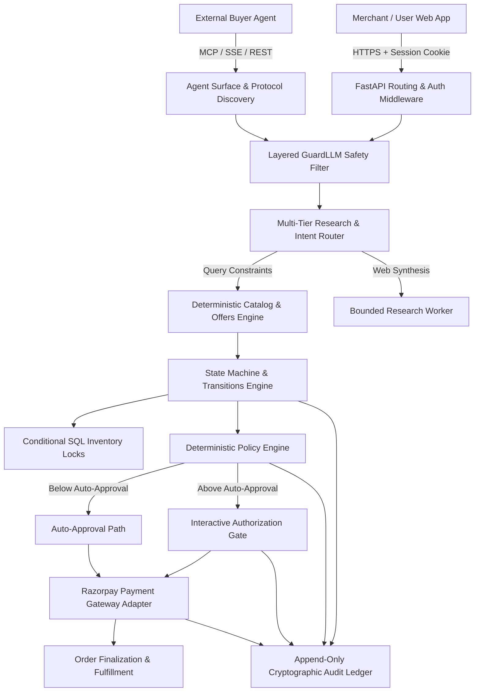

# AgentPay — System Architecture

## 1. Architectural Overview

AgentPay is an AI-native merchant commerce gateway that makes merchant catalogs discoverable, researchable, and transactable by autonomous AI buyer agents while protecting merchants with deterministic policy boundaries, human-in-the-loop authorization gates, cryptographic audit trails, and Razorpay payment integration.

---

## 2. Core Architectural Principles

### 2.1 Deterministic Commerce Core
All critical commerce operations (price calculation, inventory reservation, checkout state transitions, policy decisions, and payment verification) execute strictly in deterministic code with ACID transactional guarantees. AI models are used solely for natural language parsing, search expansion, and recommendation synthesis; models never write directly to the database or decide financial terms.

### 2.2 Strict Monetary Invariant: Integer Minor Units
All monetary values across the database, APIs, schemas, and user interfaces are strictly represented as **integer minor units** (paise for INR, e.g. ₹5,000 = 500000). Binary floating-point arithmetic is forbidden across the codebase to prevent rounding discrepancies.

### 2.3 Tenant Isolation & Security
Every entity (Product, Offer, Checkout, Authorization, Payment, Order, Campaign) is partitioned by `merchant_id`. Database queries execute through tenant-scoped repositories that strictly enforce the authenticated principal's tenant boundaries.

### 2.4 Separation of Web & Agent Credentials
- **Browser Web Surface**: Uses signed, `HttpOnly`, `SameSite=Lax` session cookies with cryptographic HMAC verification.
- **External Agent Surface**: Uses short-lived, scope-limited Bearer tokens exchanged via API keys (`catalog:read`, `checkout:write`, `payment:write`). Ambient cookies never grant API access to external agents.

---

## 3. Component Architecture

### 3.1 Catalog & Offer Pipeline
- **Dataset Source**: Amazon Reviews 2023 dataset (McAuley Lab). Compressed `.jsonl.gz` datasets are processed via reproducible pipeline stages.
- **Dataset USD-to-INR Prices & Synthetic Fulfilment Bands**: Offer prices apply the fixed demo rate of $1 = ₹100 to the source dataset's USD cents. Inventory counts and return policies are generated from deterministic hashes of product identifiers.
- **Image Handling**: Product image metadata preserves provenance and references official manufacturer CDN links with fallback placeholder generators.

### 3.2 Layered GuardLLM Safety
- **Layer 1 (Instant Filter, <1ms)**: Heuristic regex and length validation blocking prompt injection, jailbreaks, price override attempts, and token extraction without external calls.
- **Layer 2 (Semantic Safety, Meta Llama Guard)**: Deep semantic safety classification that runs locally or remotely and fails closed upon unexpected responses or transport timeouts.

### 3.3 State Transition Engine
Checkout objects move through explicit, unidirectional state transitions governed by a central rule registry:
`CREATED` -> `POLICY_CHECKED` -> `AUTHORIZED` -> `PAYMENT_PENDING` -> `PAID` -> `CONFIRMED`.
Terminal states (`CANCELLED`, `EXPIRED`, `FAILED`) reject further mutations.

### 3.4 Razorpay Payment Adapter
The payment subsystem delegates order creation, signature verification, webhook processing, and refunds to the `RazorpayPaymentProvider` implementing the canonical `PaymentProvider` protocol. Webhook signatures use HMAC-SHA256 constant-time digest comparison (`hmac.compare_digest`).

### 3.5 Append-Only Audit Ledger
Every state change, policy evaluation, prompt check, authorization decision, inventory lock, and payment status emits an immutable audit event (`audit_event` table) tagged with correlation identifiers (`request_id`, `trace_id`, `agent_run_id`).
