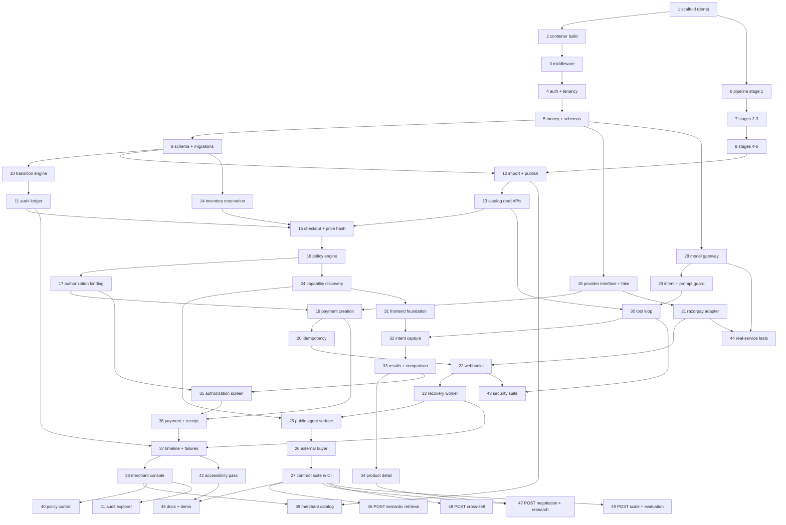

# Implementation Plan

## Overview

Forty-nine tasks. Task 1 is complete. Each remaining task ends in something runnable and cites the requirements it satisfies and, where applicable, the correctness properties it must prove.

Task 27 is the hinge: when an independent external client completes a purchase and the contract suite is green, the thesis is demonstrated. Everything in Phase K is amplification and is gated behind it (NFR-6).

| Phase | Tasks | Outcome |
|---|---|---|
| A Foundation | 1-5 | Stack starts clean, auth and tenancy enforced, money and schemas shared |
| B Catalog pipeline | 6-8 | Reproducible catalog with computed health figures |
| C Persistence and core | 9-15 | Discovery, transitions, audit, reservation, checkout integrity |
| D Policy and authorization | 16-17 | Deterministic decisions, approval bound to one purchase |
| E Payments | 18-22 | Provider abstraction, idempotent creation, verified webhooks |
| F Reliability | 23 | Price change and timeout recovery without a second charge |
| G Agent contract | 24-27 | Capability discovery, public surface, external buyer, contract suite |
| H The model | 28-30 | Bounded interpretation and a validated tool loop |
| I Frontend | 31-42 | Buyer flow first, merchant console second |
| J Evidence | 43-45 | Security suite, real-service tests, documentation |
| K Post-MVP | 46-49 | Semantic retrieval, negotiation, research, cross-sell, scale |

## Task Dependency Graph



Wave definitions for parallel scheduling. Tasks in the same wave have no dependency on each other and may run concurrently.

```json
{
  "waves": [
    { "wave": 1,  "tasks": ["2", "6"],                     "note": "container build; pipeline stage 1" },
    { "wave": 2,  "tasks": ["3", "7"],                     "note": "middleware; selection and image manifest" },
    { "wave": 3,  "tasks": ["4", "8"],                     "note": "auth and tenancy; offers, reviews, report" },
    { "wave": 4,  "tasks": ["5"],                          "note": "money and schema packages gate the core" },
    { "wave": 5,  "tasks": ["9", "18", "28"],              "note": "migrations; provider interface; model gateway" },
    { "wave": 6,  "tasks": ["10", "12", "14", "29"],       "note": "transitions; import; reservation; intent" },
    { "wave": 7,  "tasks": ["11", "13"],                   "note": "audit ledger; catalog read APIs" },
    { "wave": 8,  "tasks": ["15", "30"],                   "note": "checkout price integrity; tool loop" },
    { "wave": 9,  "tasks": ["16"],                          "note": "policy engine gates authorization" },
    { "wave": 10, "tasks": ["17", "24"],                   "note": "authorization binding; capability discovery" },
    { "wave": 11, "tasks": ["19", "31"],                   "note": "payment creation; frontend foundation" },
    { "wave": 12, "tasks": ["20", "21", "32"],             "note": "idempotency; razorpay adapter; intent capture" },
    { "wave": 13, "tasks": ["22", "33", "44"],             "note": "webhooks; results and comparison; real-service tests" },
    { "wave": 14, "tasks": ["23", "34", "35", "43"],       "note": "recovery worker; product detail; authorization screen; security suite" },
    { "wave": 15, "tasks": ["25", "36"],                   "note": "public agent surface; payment and receipt" },
    { "wave": 16, "tasks": ["26", "37"],                   "note": "external buyer; timeline and failure screens" },
    { "wave": 17, "tasks": ["27", "38", "42"],             "note": "contract suite proves the thesis; merchant console; accessibility" },
    { "wave": 18, "tasks": ["39", "40", "41", "45", "46", "47", "48", "49"], "note": "merchant surfaces, docs, and all POST work" }
  ],
  "dependencies": {
    "2":  ["1"],
    "3":  ["2"],
    "4":  ["3"],
    "5":  ["4"],
    "6":  ["1"],
    "7":  ["6"],
    "8":  ["7"],
    "9":  ["5"],
    "10": ["9"],
    "11": ["10"],
    "12": ["8", "9"],
    "13": ["12"],
    "14": ["9"],
    "15": ["11", "13", "14"],
    "16": ["15"],
    "17": ["16"],
    "18": ["5"],
    "19": ["17", "18"],
    "20": ["19"],
    "21": ["18"],
    "22": ["20", "21"],
    "23": ["22"],
    "24": ["16"],
    "25": ["23", "24"],
    "26": ["25"],
    "27": ["26"],
    "28": ["5"],
    "29": ["28"],
    "30": ["13", "29"],
    "31": ["24"],
    "32": ["30", "31"],
    "33": ["32"],
    "34": ["33"],
    "35": ["17", "33"],
    "36": ["19", "35"],
    "37": ["11", "23", "36"],
    "38": ["37"],
    "39": ["12", "38"],
    "40": ["38"],
    "41": ["38"],
    "42": ["37"],
    "43": ["22", "30"],
    "44": ["21", "28"],
    "45": ["27", "42"],
    "46": ["27"],
    "47": ["27", "34"],
    "48": ["27"],
    "49": ["27"]
  }
}
```

Critical path: 2, 3, 4, 5, 9, 10, 11, 14, 15, 16, 17, 19, 20, 24, 25, 26, 27. Pipeline tasks 6 to 8 run in parallel with 3 to 5. Model tasks 28 to 30 can run in parallel with Phase E once 5 is done.

## Tasks

## Phase A — Foundation

- [x] 1. Repository scaffold, configuration, logging, correlation, health probes
  - Directory structure, pinned dependencies, Makefile, `.env.example`, `.gitignore`
  - Typed settings with `fake`/`mock` provider defaults and a startup guard against placeholder secrets
  - Structured JSON logging with redaction by key name and by value shape
  - Correlation identifiers surviving async boundaries and worker adoption
  - `/health` and `/health/db` that never leak the connection string
  - Four architecture import contracts, wired into the lint target
  - Repository-wide credential sweep, verified against a planted key
  - 82 tests passing, ruff and mypy clean
  - _Requirements: 14.3, 14.7, 24.10, 24.11, 25.1, 25.2, 25.3, 25.4, 25.6, 25.7, 25.8, 25.9, 23.1, 23.2, 23.3, 23.4, 38.8, 44.2_

- [x] 2. Fix the container build and prove the stack starts clean
  - Reorder `api.Dockerfile` and `worker.Dockerfile` to copy source before the editable install, so setuptools package discovery sees real directories
  - Verify `docker compose up -d --build` reaches healthy for postgres, redis, api, worker
  - Confirm `curl /health` returns `ok: true` from inside the container network
  - Add a smoke test asserting the compose config is valid and the api healthcheck passes
  - _Requirements: 44.1, 44.2_

- [x] 3. Cross-cutting middleware
  - Request and trace identifier assignment, echoed as response headers
  - Uniform success and error envelope serialization
  - Global exception handler mapping domain errors to the error code registry, with unexpected exceptions becoming `INTERNAL_ERROR` and the detail logged rather than returned
  - Redis-backed rate limiter returning `RATE_LIMITED` with a retry hint
  - Restricted CORS driven by configuration
  - _Requirements: 24.8, 24.9, 25.1, 25.2_

- [x] 4. Authentication, RBAC, and tenant isolation
  - Session authentication for the web surface
  - API key to scoped bearer token exchange for external agents, with `catalog:read`, `checkout:write`, `payment:write`
  - Roles: buyer, merchant administrator, merchant operator, platform administrator
  - Repository base class that requires a tenant filter at construction, so an unfiltered query raises rather than returning rows
  - Ownership checks for buyer-scoped aggregates
  - Tests: cross-tenant read denied, missing scope returns 403, expired token denied, unfiltered query raises
  - _Requirements: 24.1, 24.2, 24.3, 24.4, 24.5, 24.6, 24.7_
  - _Properties: Property 28_

- [x] 5. Money and schema packages
  - `packages/money`: integer minor-unit arithmetic, parsing, and formatting; no float path
  - `packages/schemas`: versioned Pydantic models and exported JSON Schema for intent, offer, checkout, authorization, payment, order, capability document, and tool arguments
  - Intent schema with `additionalProperties: false` on financial fields
  - Property tests for exact arithmetic and lossless format round-trip
  - _Requirements: 11.2, 11.3, 22.1, 22.2, 36.5_
  - _Properties: Property 1, Property 3_

---

## Phase B — Catalog pipeline

- [x] 6. Pipeline stage 1: candidate extraction
  - `iter_jsonl_gz` streaming gzip in text mode, skipping malformed lines without aborting
  - `normalize_images` handling both per-image object lists and parallel columnar lists
  - `normalize_details` handling object or JSON-encoded string, empty object on parse failure
  - `normalize_text_list` handling list, bare string, or absent
  - `classify_subcategory` keyword rules over title and features, with an uncategorized fallback
  - `completeness_score` from 0 to 100 over the seven declared factors
  - Hard rejects: missing parent identifier, title absent or outside 8 to 300 characters, no usable image, duplicate parent identifier across files
  - Batched SQLite writes of 2,000 with no accumulation beyond one batch, indexed on subcategory and score
  - `MAX_LINES_DEBUG` cap and stage-boundary resumability
  - Fixture `.gz` files covering both image shapes, string-encoded details, malformed lines, over-length titles, duplicates
  - _Requirements: 1.1, 1.2, 1.3, 1.4, 1.5, 1.6, 1.7, 1.8, 1.9, 1.10, 1.11, 1.12, 1.13, 1.14, 1.15, 1.16_

- [x] 7. Pipeline stages 2 and 3: selection and image manifest
  - Per-subcategory quota selection ordered by score descending then rating volume descending
  - Deterministic product identifier derived from the source parent identifier
  - `products.jsonl` plus verbatim `raw_metadata/{product_id}.json` per selected product
  - Unit normalization: currency to minor units, memory and storage to GB, weight to grams, dimensions to millimetres, delivery to integer days
  - Source price carried as non-authoritative reference metadata
  - Image manifest with best-resolution fallback, per-product URL dedupe, and no downloading
  - Tests: quota never exceeded, shortfall reported not padded, identifiers stable across runs, no duplicate storage key
  - _Requirements: 2.1, 2.2, 2.3, 2.4, 2.5, 2.6, 2.7, 2.8, 2.9, 2.10, 2.11_
  - _Properties: Property 24, Property 25_

- [x] 8. Pipeline stages 4, 5, and 6: offers, reviews, report
  - Seeded price, delivery, return period, and inventory from a hash of the parent identifier plus per-field salt
  - Per-subcategory price bands, integer minor units, `pricing_source` on every offer, reserved quantity zero, offer version one
  - Review linking that loads the selected identifier set first and discards non-matches while streaming, with deterministic review identifiers and an index on parent identifier
  - Quality report computed from the produced artifacts, reporting the configured target alongside the achieved total
  - Tests: stage 4 run twice is byte-identical, prices within band, re-run creates no duplicate reviews, report counts equal artifact line counts
  - _Requirements: 3.1, 3.2, 3.3, 3.4, 3.5, 3.6, 4.1, 4.2, 4.3, 4.4, 4.5, 5.1, 5.2, 5.3, 5.4_
  - _Properties: Property 23, Property 26_

---

## Phase C — Persistence and commerce core

- [x] 9. PostgreSQL schema and migrations
  - Alembic migrations for every table in the design, with pgvector enabled
  - `inventory` split from `offer` with check constraints on non-negative and reserved-within-available quantities
  - `reservation` with unique checkout and explicit status
  - `idempotency_record` with unique actor, endpoint, and key
  - `provider_event` keyed on the provider identifier
  - `catalog_version` with a partial unique index enforcing one published version per merchant
  - `audit_event` append-only, amounts as bigint minor units
  - Indexes for the deterministic filter path: offer by merchant and status, product by category and status, offer by price, GIN on specifications
  - Tests: migrate up and down cleanly, every constraint and unique index asserted
  - _Requirements: 6.3, 10.4, 16.3, 17.2, 44.8, 44.9_

- [x] 10. State transition engine
  - Transition table as data, covering every state and event in the design
  - Single `transition(aggregate, event, context, session)` performing the seven ordered checks
  - New status and audit event written in the caller's transaction; the function never commits
  - Remove any direct status assignment from services and routers
  - Tests: exhaustive legality matrix driven from the table, every illegal transition rejected, terminal states reject everything, rejected transition leaves state and audit unchanged, induced transaction failure persists neither
  - _Requirements: 8.1, 8.2, 8.3, 8.4, 8.5, 8.6, 8.7, 8.8_
  - _Properties: Property 12, Property 14, Property 15, Property 16_

- [ ] 11. Audit ledger
  - Append-only writer with the full event vocabulary
  - Actor, aggregate, input hash, decision, reason code, policy version, model version, amount, and correlation identifiers
  - `GET /audit/events` and `GET /audit/aggregates/{type}/{id}` returning chronological order
  - Tests: one event per state change, correlation identifiers propagate into worker tasks, no secret appears in any event
  - _Requirements: 9.1, 9.2, 9.3, 9.4, 9.5, 9.6_
  - _Properties: Property 15_

- [ ] 12. Catalog import to PostgreSQL with atomic publish
  - Read `products.jsonl` and `offers.jsonl` into a draft catalog version
  - Validate against data quality rules, flagging needs-review rather than discarding
  - Atomic publish flipping status and superseding the prior version in one transaction
  - Import run provenance with source name, checksum, schema version, licence note, and timing
  - Idempotent re-import and idempotent demo seed
  - Tests: publish atomic under induced mid-transaction failure, a checkout created pre-publish still resolves its own snapshot, re-import creates no duplicates
  - _Requirements: 6.1, 6.2, 6.3, 6.4, 6.5, 6.6, 6.7, 6.8_

- [ ] 13. Catalog and offer read APIs
  - `POST /catalog/search`, `GET /catalog/products/{id}`, `GET /catalog/offers/{id}`, `POST /offers/query`, `POST /offers/{id}/validate`
  - Deterministic SQL filtering on category, price ceiling, minimum memory, minimum storage, maximum delivery, positive availability
  - Ranking on price fit, specification fit, delivery fit, return policy, merchant ranking
  - Bounded result count, reasoning-relevant fields only, offer expiry included
  - Tests: every filter honoured, no out-of-stock or expired offer returned, count capped, response validates against schema, the hero query returns only constraint-satisfying offers
  - _Requirements: 7.1, 7.2, 7.3, 7.4, 7.5, 7.6, 7.7, 7.8_
  - _Properties: Property 27_

- [ ] 14. Inventory reservation
  - Conditional reserve as a single statement with the guard inside the `WHERE` clause
  - Release keyed on reservation identifier with a status check, making double release a no-op
  - Commit on verification decrementing both reserved and available quantities
  - Tests: N concurrent reservations of the last unit yield exactly one winner, double release changes nothing, reserve then release restores quantities, quantities never negative under any interleaving
  - _Requirements: 10.1, 10.2, 10.3, 10.4, 10.5, 10.6, 10.7, 10.8_
  - _Properties: Property 6, Property 7, Property 8_

- [ ] 15. Checkout with price integrity
  - `POST /checkout` ordered: load offer, reserve inventory, validate status and expiry, compute totals server-side, build immutable snapshot, compute price hash, persist with audit
  - `compute_price_hash` over canonical sorted JSON of the nine declared fields
  - Configured discounts only; client-supplied amounts ignored
  - Short expiry window; refresh and cancel endpoints
  - Tests: totals are exact integers, hash stable for identical inputs and differing on any field change, expired checkout blocks payment creation, a request carrying an amount field is ignored
  - _Requirements: 11.1, 11.2, 11.3, 11.4, 11.5, 11.6, 11.7, 11.8, 11.9, 11.10, 11.11_
  - _Properties: Property 1, Property 2, Property 4_

---

## Phase D — Policy and authorization

- [ ] 16. Deterministic policy engine
  - Pure `evaluate(inputs, rules, now)` returning decision and reason code, with no clock and no session of its own
  - Rule order: offer validity, inventory, currency, category, merchant, maximum amount, policy version, auto-approval threshold
  - Buyer policy and merchant rules loaded as explicit inputs
  - Persist every decision with inputs hash and policy version
  - Tests: table-driven across the full reason registry, identical inputs give identical decisions, an amount above maximum is never allow, a blocked category never yields require-approval
  - _Requirements: 12.1, 12.2, 12.3, 12.4, 12.5, 12.6, 12.7, 12.8, 12.9_
  - _Properties: Property 17, Property 18, Property 19_

- [ ] 17. Authorization binding
  - Bind to buyer, merchant, checkout, amount ceiling, currency, category, expiry, and checkout price hash
  - Approve, reject, revoke endpoints with ownership enforcement
  - Consumed marking after payment creation; re-validation immediately before any provider interaction
  - Approval payload carrying exact merchant, product, quantity, itemised amounts, total, currency, delivery, return policy, expiry, policy decision and reason
  - Tests: authorization for checkout A cannot pay checkout B, expired rejected, consumed rejected, hash mismatch rejected, non-owner denied
  - _Requirements: 13.1, 13.2, 13.3, 13.4, 13.5, 13.6, 13.7, 13.8, 13.9, 13.10_
  - _Properties: Property 5_

---

## Phase E — Payments

- [ ] 18. Payment provider interface and fake provider
  - `PaymentProvider` protocol: create order, fetch payment, fetch order, verify signature, refund
  - `FakePaymentProvider` with injectable success, failure, timeout, delayed webhook, and invalid signature behaviours
  - `order_count_for(checkout_id)` for duplicate-charge assertions
  - Shared contract test suite both implementations must satisfy
  - Provider selected by configuration, fake remaining the default
  - _Requirements: 14.1, 14.2, 14.3, 14.4, 14.5, 14.6, 14.7, 14.8_

- [ ] 19. Payment creation endpoint
  - `POST /payments` in the twelve-step order from the design, with the provider call as the first irreversible step
  - Revalidate checkout state, expiry, authorization binding and expiry, amount, currency, and price hash before contacting the provider
  - Internal payment attempt created before the provider call
  - Browser-safe response only: provider order identifier, public key, amount, currency, checkout identifier
  - Tests: no secret in the response, a hash mismatch produces zero provider calls, amount recomputed server-side, precondition failure never reaches the provider
  - _Requirements: 15.1, 15.2, 15.3, 15.4, 15.5, 15.6, 15.7, 15.8, 15.9_
  - _Properties: Property 5_

- [ ] 20. Idempotency layer
  - Middleware computing a request hash over canonical body, inserting `in_progress` before execution
  - Replay of a completed record returns the stored response and status
  - Conflict with a differing request hash returns key-reused-with-different-request
  - Concurrent duplicate returns request-in-progress, retryable
  - Emit an idempotency-replayed audit event on replay
  - Tests: two payment requests with one key create exactly one provider order, replay is byte-identical, differing body never executes, concurrent duplicates have exactly one executor
  - _Requirements: 17.1, 17.2, 17.3, 17.4, 17.5, 17.6, 17.7, 17.8, 17.9_
  - _Properties: Property 9, Property 10, Property 11_

- [ ] 21. Razorpay adapter
  - Implement the provider interface against Razorpay test mode with server-side credentials
  - HMAC signature verification over the raw body
  - Independent status fetch for verification
  - Timeout and connection errors mapped to payment timeout or unknown, never a generic failure
  - Tests: adapter passes the same shared contract suite as the fake; signature verification against known-good and tampered payloads
  - _Requirements: 14.1, 14.6, 14.7, 15.8, 16.1_

- [ ] 22. Webhook processing
  - Raw-body HMAC verification before any parsing
  - Provider event insert for dedupe; conflict is a no-op
  - Provider to internal event mapping, then independent provider status fetch
  - Order finalization only after independently trusted verification, exactly once
  - Reservation committed on verification
  - No authenticated session required; signature is the sole trust mechanism
  - Tests: forged signature changes no state, replay is a no-op, out-of-order events reach the correct final state, order confirms exactly once, browser-reported success without a webhook holds the order pending
  - _Requirements: 16.1, 16.2, 16.3, 16.4, 16.5, 16.6, 16.7, 16.8, 16.9_
  - _Properties: Property 13_

---

## Phase F — Reliability

- [ ] 23. Failure detection and recovery worker
  - Checkout expiry sweep transitioning checkouts and releasing reservations, idempotently
  - Payment status polling for unknown payments with bounded retry, then manual review
  - Webhook retry job
  - Price-change detection at payment time producing price-changed with zero provider calls and a plain-language explanation
  - `next_actions` populated so a client can offer recovery without hardcoded failure knowledge
  - Tests: the three declared failure scenarios, no scenario produces a second charge, sweep is idempotent
  - _Requirements: 18.1, 18.2, 18.3, 18.4, 18.5, 18.6, 18.7, 18.8, 18.9, 18.10, 18.11_
  - _Properties: Property 8_

---

## Phase G — The agent contract

- [ ] 24. Capability discovery
  - `GET /.well-known/agent-commerce` and `GET /api/v1/agent/capabilities` returning an identical payload
  - Built from live settings, merchant rules, and buyer policy on each request, then briefly cached
  - Declares schema version, authentication method, token endpoint, scopes, capabilities, limits, endpoints, policy summary, provider and test mode
  - States plainly that no external protocol is certified or fully implemented
  - Tests: both paths identical, changing the auto-approval limit changes the payload, no secret-shaped value present, response validates against schema
  - _Requirements: 19.1, 19.2, 19.3, 19.4, 19.5, 19.6, 19.7, 19.8, 19.9, 19.10_

- [ ] 25. Public agent surface
  - `/api/v1/agent/*` endpoints per the design, delegating to the same services as the internal surface
  - Scope enforcement per endpoint; idempotency required on money-mutating agent endpoints
  - No privileged shortcut, special header, or backdoor
  - Tests: every endpoint enforces its scope, agent and internal paths produce identical domain results, missing scope returns a deterministic error
  - _Requirements: 20.1, 20.2, 20.3, 20.4, 20.5, 20.6_

- [ ] 26. External buyer agent, separate repository
  - `buyer-agent/` with `AgentPayClient`: capabilities, authenticate, search, query offers, negotiate, create checkout, request authorization, create payment, get payment status, get order
  - Rule-based intent translation for live-demo reliability, with an optional model path
  - Its own CLI approval prompt, so human-in-the-loop happens in the client's own interface
  - Timestamped step output with identifiers, suitable for a side-by-side terminal demo
  - README stating explicitly that it holds no special access
  - Tests: full scenario against the fake provider reaches a confirmed order
  - _Requirements: 20.1, 20.7, 20.8, 20.9, 20.11_

- [ ] 27. Contract test suite in CI
  - `tests/contract/` with capability discovery, full purchase flow, negotiation bounds, authorization binding, idempotent payment, price-change rejection, payment timeout recovery, and blocked unauthorized access
  - Driven through the same client the external buyer uses
  - Compliance summary written to `docs/` recording pass count, transitions covered, and failure codes covered
  - Meta-test asserting the documented transitions are covered
  - CI job triggered on any change to the public agent surface
  - _Requirements: 21.1, 21.2, 21.3, 21.4, 21.5, 21.6, 21.7_

---

## Phase H — The model

- [ ] 28. Model gateway
  - `ModelProvider` protocol: generate, embed, moderate
  - `MockModelProvider` returning deterministic schema-valid responses, as the default
  - `GroqModelProvider` targeting GPT-OSS-120B with timeout, retry, and token accounting
  - Model version recorded on audit events the model influenced
  - Tests: mock satisfies the protocol, timeout produces a structured error rather than hanging
  - _Requirements: 22.15, 22.16_

- [ ] 29. Intent extraction and prompt guard
  - Structured intent extraction validated against the schema, rejecting unknown financial fields
  - Prompt safety classification before the main agent, treated as one layer not the only defence
  - Input length and encoding limits
  - Untrusted-content evidence framing with provenance and an explicit non-instruction statement
  - Output schema validation
  - Tests: unknown financial fields rejected, injection in a user message does not alter extracted constraints, over-length input rejected cleanly, budget rendered in minor units
  - _Requirements: 22.1, 22.2, 22.3, 22.4, 22.5, 22.6_

- [ ] 30. Tool loop
  - Fourteen tools with full schemas: types, maximum lengths, enumerations, authentication requirement, side-effect class, confirmation requirement, timeout, audit event
  - Step and wall-clock limits per run
  - `agent_run`, `tool_call`, and `evidence` persistence
  - Confirmation gate before any state-changing tool
  - Tools invoke services; none receives a database session
  - Tests: non-allowlisted tool blocked and audited, argument injection rejected, step limit enforced, state-changing tools require confirmation, no tool holds a session
  - _Requirements: 22.7, 22.8, 22.9, 22.10, 22.11, 22.12, 22.13, 22.14, 23.5, 23.6, 23.7_

---

## Phase I — Frontend

Build one polished buyer flow before any dashboard, so the merchant console has real runs to display.

- [ ] 31. Frontend foundation
  - Next.js with TypeScript, Tailwind, and shadcn/ui, with `(buyer)` and `(merchant)` route groups
  - `lib/api.ts`: typed client, envelope handling, automatic idempotency key generation on money-mutating requests, `next_actions` surfaced to callers
  - `lib/money.ts`: the only module permitted to touch monetary values, integer in and string out, no arithmetic elsewhere
  - `lib/time.ts`: server-time-anchored offset measurement for countdowns
  - `lib/auth.ts`: session handling and token expiry prompting re-authentication rather than failing silently
  - Types generated from backend schemas so a contract change is a compile error
  - Root layout with a persistent test-mode banner driven by the capability document
  - Error boundary per route group; explicit empty, loading, and error states as shared primitives
  - Tests: no secret in the built bundle, money formatting round-trips, no float arithmetic on amounts
  - _Requirements: 30.1, 30.2, 36.1, 36.2, 36.3, 36.4, 36.5, 36.6, 36.9, 36.10, 36.11, 37.7, NFR-12_

- [ ] 32. Buyer intent capture and AI activity
  - Natural-language entry as the primary route
  - Extracted constraints rendered structurally, editable and re-runnable without retyping
  - Step-by-step activity summary naming each action and outcome, with candidate and satisfying counts
  - In-flight progress indication; no chain-of-thought, no deliberation narration
  - Failure state naming what completed and what did not, with retry
  - `useAgentRun` hook polling while in flight and stopping on terminal state
  - _Requirements: 26.1, 26.2, 26.3, 26.4, 26.5, 26.6, 26.7, 26.8, 26.9_

- [ ] 33. Offer results, filters, and comparison
  - Offer cards showing price, key specifications, delivery, inventory, rating, and expiry
  - Deterministic filters adjustable independently of the conversation
  - Comparison table across offers rather than products
  - Recommended offer identified explicitly, justified against the buyer's stated constraints
  - Rejected candidates showing which constraint they failed
  - Selecting an offer does not authorize anything
  - Prices labelled as generated rather than scraped
  - _Requirements: 26.10, 28.1, 28.2, 28.3, 28.4, 28.5, 28.6, 28.7, 28.8, 27.8_

- [ ] 34. Product detail with dynamic emphasis
  - Gallery, title, rating, price, key specifications, stock, delivery
  - Specification emphasis driven by stated intent, with every value sourced from the backend
  - Fit assessment separating satisfied requirements from caveats
  - Labelled placeholder for a missing image
  - Product question interface stubbed against the research service, wired fully in task 47
  - _Requirements: 27.1, 27.2, 27.3, 27.7, 27.9, 27.10_

- [ ] 35. Authorization screen
  - Exact merchant, product, quantity, itemised price, shipping, tax, discount, and total
  - Delivery estimate and return policy
  - Policy decision, reason code, and which checks passed versus triggered approval
  - Expiry countdown anchored to server time via measured offset, with expiry enforced server-side
  - Expiry while displayed disables approval and offers revalidation
  - Approve and reject equally weighted; no pre-selection, no auto-submit, no default focus on approve
  - Accessible label on approve including amount and merchant; full keyboard operability
  - _Requirements: 29.1, 29.2, 29.3, 29.4, 29.5, 29.6, 29.7, 29.8, 29.9, 29.10, 29.11, 29.12, 29.13, 36.7, 36.8_

- [ ] 36. Payment progress and receipt
  - Distinct stages for order creation, buyer payment, and server-side verification
  - Plain-language state descriptions, never a raw status code
  - Pending verification never presented as a confirmed order
  - Verified receipt with amount, payment identifier, order identifier, and a link to the transaction record
  - Status obtained from the backend; a client-side provider callback is never treated as proof
  - `usePaymentStatus` polling with backoff until verified, failed, or unknown-exhausted
  - Receipt retrievable later from order history
  - _Requirements: 30.3, 30.4, 30.5, 30.6, 30.7, 30.8, 30.9, 30.10_

- [ ] 37. Transaction timeline and failure screens
  - Timeline rendered from the audit ledger, with correlation identifiers displayed
  - Price-changed screen showing approved amount, current amount, and that no charge was made, with fresh comparison and new authorization as actions
  - Payment-uncertain screen stating no second payment was created and status is being checked, with refresh
  - Policy-blocked screen showing the reason rather than a generic error
  - Every failure state recoverable without a page reload
  - _Requirements: 31.1, 31.2, 31.3, 31.4, 31.5, 31.6, 31.7, 31.8, 31.9, 31.10, 31.11_

- [ ] 38. Merchant console and agent activity inspection
  - KPI tiles for AI buyers, offer requests, AI-originated orders, and conversion, each computed from logged data
  - Recent agent activity with per-entry outcome including successes, price changes, and policy blocks
  - Per-agent-run detail: request, tools invoked, offer selected, decision rationale, policy decision, status
  - Decision evidence only, no chain-of-thought
  - Blocked tool calls and blocked actions shown, not omitted
  - Failed and recovered payments distinct from successful ones
  - Agent-view page rendering the live capability document and external buyer run outcomes with traversed transitions
  - Tests: no hardcoded figure on any console view, merchant scoping enforced
  - _Requirements: 32.1, 32.2, 32.3, 32.4, 32.5, 32.6, 32.7, 32.8, 32.9, 32.10_

- [ ] 39. Merchant catalog operations
  - Import, validate, review, publish as ordered steps requiring an explicit publish action
  - Import history with per-run provenance
  - Health figures computed from the actual import run, equal to the quality report values
  - Needs-review list showing the rule each product violated
  - Active offers, inventory warnings, and the generated-price note
  - Tests: displayed health figures equal computed artifact values
  - _Requirements: 33.1, 33.2, 33.3, 33.4, 33.5, 33.6, 33.7, 33.8, 33.9, 33.10_

- [ ] 40. Merchant AI policy control
  - Display and edit maximum transaction, auto-approval limit, allowed and blocked categories, maximum discount, out-of-stock selling, return policy override
  - Amounts shown in major units, stored and transmitted in minor units
  - Rule change versioned with an actor recorded
  - Rule change reflected in the served capability document
  - Merchant administrator role required; no model path to a rule change
  - _Requirements: 34.1, 34.2, 34.3, 34.4, 34.5, 34.6, 34.7, 34.8_

- [ ] 41. Audit explorer
  - Search by transaction, agent run, checkout, payment, order, and buyer identifier, and by date range
  - Per-event display of type, actor, aggregate, amount, reason code, policy version, model version, timestamp
  - Chronological ordering per aggregate; navigation to related checkout, authorization, payment, and order
  - Merchant scoping enforced; no secret displayed
  - Every money action traceable to the policy decision and authorization that permitted it
  - _Requirements: 35.1, 35.2, 35.3, 35.4, 35.5, 35.6, 35.7_

- [ ] 42. Interface quality and accessibility pass
  - Full keyboard path from intent through authorization to receipt
  - Accessible names and roles on all interactive controls; state changes announced
  - Automated accessibility checks gating the buyer flow and the authorization view
  - Contrast sufficient; status never conveyed by colour alone
  - Responsive layouts across mobile, tablet, desktop
  - Motion subtle and reduced-motion respected; no layout shift on async resolution
  - _Requirements: 37.1, 37.2, 37.3, 37.4, 37.5, 37.6, 37.8, 37.9, 37.10, 37.11_

---

## Phase J — Evidence

- [ ] 43. Security test suite
  - Prompt injection fixtures instructing the agent to ignore a budget, exfiltrate a credential, report payment success, and override a return policy
  - Cross-tenant access, forged webhook, replayed webhook, duplicate payment, altered amount, altered checkout identifier, expired authorization, tool argument injection
  - Import contract test asserting no database import reachable from the agent layer
  - Every case asserting a specific error code rather than merely a non-200
  - _Requirements: 22.6, 22.7, 22.9, 23.1, 23.2, 23.3, 23.4, 24.5, 24.6, 25.9_
  - _Properties: Property 21, Property 22, Property 28_

- [ ] 44. Real-service integration tests
  - Groq integration exercising structured output validation, timeout handling, and error mapping against live responses
  - Razorpay test-mode integration exercising order creation, payment fetch, and signature verification against live responses
  - Separately marked so the default run excludes them; skip rather than fail when credentials are absent
  - Fakes remain the default for every other suite
  - Test-mode transactions labelled as test mode
  - _Requirements: 38.1, 38.2, 38.3, 38.4, 38.5, 38.6, 38.7, 38.9, 38.10_

- [ ] 45. Documentation and demo
  - `docs/architecture.md`, `api.md`, `security.md`, `state-machine.md`, `failure-modes.md`, `demo-script.md`
  - ADRs for each significant decision
  - `docs/protocol-scope.md` with a row per external concept covering ACP, AP2, x402, and MCP, each marked conceptually inspired, structurally implemented, or not implemented, with justification
  - README using approved phrasing, stating limitations and production gaps, and noting that prices are generated
  - Verify a clean clone reproduces the demo from documented commands alone
  - _Requirements: 44.1, 44.2, 44.3, 44.4, 44.5, 44.6, 44.7, 44.10_

---

## Phase K — Post-MVP

Gated behind task 27. Nothing here is started until the external buyer completes a purchase and the contract suite is green.

- [ ] 46. [POST] Semantic retrieval
  - Embeddings over title, normalized features, and description into pgvector
  - Merge semantic candidates with deterministic filtering before ranking
  - Semantic score never influences price, inventory, or eligibility
  - Candidates failing a hard constraint excluded; every offer revalidated before display
  - _Requirements: 40.1, 40.2, 40.3, 40.4, 40.5, 40.6_
  - _Properties: Property 27_

- [ ] 47. [POST] Bounded negotiation and research agent
  - Negotiate endpoint with the floor computed in the policy engine, accept at or above, counter below, close after the round limit, rounds persisted
  - Self-hosted SearXNG as a sixth compose service with a hardened configuration
  - `SearchProvider` interface with the null provider remaining the default
  - Bounded research loop: step, search, and page limits, size and wall-clock caps, Redis caching
  - `search_web` host from configuration only; `open_url` allowlisted with private, loopback, and link-local blocked
  - Evidence objects with source, publisher, retrieval time, content hash, excerpt, confidence, source type
  - Claims labelled catalog fact, documentation fact, inference, or unresolved; research unavailable never fabricates a citation
  - Wire the product question interface from task 34 to the research service
  - _Requirements: 27.4, 27.5, 27.6, 39.1, 39.2, 39.3, 39.4, 39.5, 39.6, 39.7, 39.8, 39.9, 39.10, 41.1, 41.2, 41.3, 41.4, 41.5, 41.6, 41.7, 41.8, 41.9, 41.10, 41.11, 41.12, 41.13_
  - _Properties: Property 20_

- [ ] 48. [POST] Cross-sell with measured effect
  - Merchant-configured category pairings; no model-invented compatibility
  - Recommendation endpoint capped, with machine-readable reason codes translated to prose by the model
  - Never auto-added; inventory and category rules respected
  - Instrument baseline and assisted average order value and attachment rate, measured from a logged evaluation run
  - _Requirements: 42.1, 42.2, 42.3, 42.4, 42.5, 42.6, 42.7, 42.8, 42.9, 42.10_

- [ ] 49. [POST] Scale to twenty thousand products and agent evaluation
  - Remove the debug cap, run the full pipeline, import at one hundred, one thousand, then the full target
  - Measure search latency at each stage; add an index only where measurement justifies it
  - Verify 95th-percentile catalog search under three hundred milliseconds at full size
  - Evaluation set of at least one hundred intents across easy, medium, ambiguous, and adversarial
  - Measure intent accuracy, constraint satisfaction, retrieval and selection correctness, tool success, unsupported-claim rate, latency
  - _Requirements: 43.1, 43.2, 43.3, 43.4, 43.5, 25.10, 25.11_

---

## Notes

### Build order rationale

The buyer flow is built before the merchant console because the console displays agent runs, and there are none to display until the buyer flow produces them. Building the dashboard first would mean designing against imagined data.

Payments come before the model layer. The deterministic core must be correct and testable against the fake provider before an LLM is anywhere near it, and every payment test runs without a model.

### Gating

Nothing in Phase K starts before task 27 passes. That includes the sixth compose service for SearXNG. The rule exists because infrastructure work does not advance the thesis, and the thesis is what is being judged.

### Test defaults

The default run is `tests/unit` plus `tests/security`: no Docker, no credentials, no network. Integration tests require PostgreSQL and Redis. Contract tests run against the fake provider. Real-service tests are separately marked and skip when credentials are absent.

### Credentials

Only `.env.example` is committed, with every secret blank. The credential sweep in task 43 fails the build if a credential-shaped string reaches a tracked file. Groq and Razorpay keys live in an untracked `.env`.

### Competition bar

The brief requires every money action explainable, bounded and gated, with the audit trail and one failure handled gracefully. The tasks that deliver each:

| Bar clause | Tasks |
|---|---|
| Explainable | 11 audit ledger, 33 recommendation rationale, 38 agent run detail, 41 audit explorer |
| Bounded | 16 policy engine, 30 tool loop, 40 policy control, 43 security suite |
| Gated | 17 authorization binding, 35 authorization screen |
| Audit trail | 11, 37 timeline matching the ledger |
| One failure, gracefully | 23 recovery worker, 37 price-changed and payment-uncertain screens |

### Definition of done

| Artifact | Task |
|---|---|
| AI-readable merchant | 24 |
| Independent AI buyer | 26 |
| Intelligent decisions with evidence | 30, 33 |
| Deterministic financial core, mechanically enforced | 43 |
| Safe authorization | 17, 27, 35 |
| Real Razorpay test transaction | 21, 22, 44 |
| Graceful failure | 23, 37 |
| Revenue feature with measured effect | 48 |
