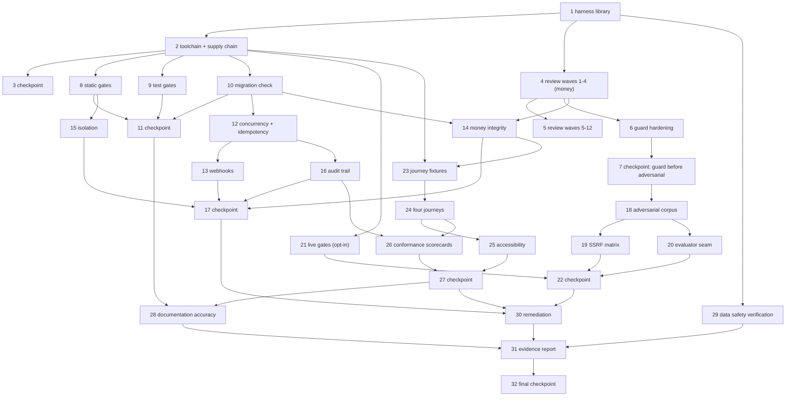

# Implementation Plan

## Overview

Thirty-two tasks, 130 leaf sub-tasks. The audit machine is built before it is pointed at anything, because a gate with no artifact is an opinion. Order follows money at risk: the harness and toolchain first, then the review waves over `services/payments`, `services/checkout`, `services/authorization`, and `packages/security`, then the guard hardening, then the remaining gates, then the browser and conformance work, then the report.

Two sequencing rules are load-bearing and are enforced by the wave layout rather than by good intentions:

1. **Guard hardening precedes the adversarial harness.** `services/agent/guard.py` returns `is_safe=True` on transport error, on a non-200 response, and on an unparseable body. Measuring an adversarial corpus against that guard produces a number that means nothing, so Task 6 lands before Task 18 and its passing artifact must predate any independent-evaluator install (Requirement 14.1, Property 4).
2. **Nothing is written outside the gate runner.** Task 1.1 exists before every other executing task because `Property 5` is structural: if a command did not go through `audit/runner.py`, no artifact describes it.

Everything runs in the offline default posture (`PAYMENT_PROVIDER=fake`, `MODEL_PROVIDER=mock`). The two live gates are built with their skip semantics and bounds as required work; executing them against real endpoints is opt-in and marked optional.

| Phase | Tasks | Outcome |
|---|---|---|
| A Audit machine | 1-3 | Harness library, records, toolchain, supply-chain register, service readiness |
| B Review waves | 4-5 | Every in-scope file inspected, money paths first, ledger populated |
| C Guard hardening | 6-7 | Fail-closed Layer 2, degraded-mode accounting, every entry point enumerated |
| D Static, test, migration | 8-11 | Format, lint, types, contracts, suites, skips, order independence, schema round trip |
| E Correctness harnesses | 12-17 | Idempotency, oversell, atomicity, webhooks, money integrity, isolation, audit trail |
| F Adversarial and live | 18-22 | Corpus with baseline comparison, SSRF matrix, evaluator seam, bounded live gates |
| G Browser and conformance | 23-27 | Four journeys across two viewports, accessibility, vision and track scorecards |
| H Report | 28-32 | Documentation accuracy, data safety, remediation, evidence report |

## Execution Order



Epic-level dependencies:

```json
{
  "dependencies": {
    "2":  ["1"],
    "3":  ["1", "2"],
    "4":  ["1"],
    "5":  ["4"],
    "6":  ["4"],
    "7":  ["6"],
    "8":  ["2"],
    "9":  ["2"],
    "10": ["2"],
    "11": ["8", "9", "10"],
    "12": ["10"],
    "13": ["12"],
    "14": ["4", "10"],
    "15": ["8"],
    "16": ["12"],
    "17": ["13", "14", "15", "16"],
    "18": ["7"],
    "19": ["18"],
    "20": ["18"],
    "21": ["2"],
    "22": ["19", "20", "21"],
    "23": ["2", "14"],
    "24": ["23"],
    "25": ["24"],
    "26": ["16", "24"],
    "27": ["25", "26"],
    "28": ["11", "27"],
    "29": ["1"],
    "30": ["17", "22", "27"],
    "31": ["28", "29", "30"],
    "32": ["31"]
  }
}
```

Critical path: 1, 4, 6, 18, 19, 30, 31. The journey and conformance work (23-27) runs in parallel with the adversarial work once the guard is hardened.

---

## Tasks

## Phase A — The audit machine

- [ ] 1. Audit harness library and its meta-tests
  - [ ] 1.1 Build the gate runner and the gate registry
    - Create `agentpay/audit/__init__.py` and `agentpay/audit/runner.py` with the frozen `GateResult` dataclass, its derived `passed` property, and a `GateRunner` that is the only command executor in the audit
    - Record per gate: human-readable command, `argv`, `cwd`, exit code, UTC start and end timestamps, duration, artifact directory, per-stream SHA-256 digests, and the names only of environment keys consulted
    - Support the three-way outcome split: `passed`, `failed`, `blocked`, plus `skipped` with a reason and a class; a command that cannot start or exceeds its ceiling is `blocked`, never `failed`
    - Create `agentpay/audit/gates.py` holding the complete gate id table from the design (`STATIC-*`, `TEST-*`, `MIG-*`, `CORR-*`, `ISO-*`, `MONEY-*`, `AUDIT-*`, `GUARD-*`, `ADV-*`, `JOURNEY-*`, `A11Y-*`, `LIVE-*`, `DOC-*`, `TOOL-*`) with each gate's command, working directory, wall-clock ceiling, and `GATE_SCOPES` glob tuple, authored once so per-gate tasks never contend on this file
    - Create `agentpay/audit/cli.py` exposing `python -m audit <gate-id>` and `python -m audit --all`
    - Write every artifact under `.audit/runs/<run_id>/` with `env.json` and `gates/<gate_id>/{meta.json,stdout.log,stderr.log}`
    - _Requirements: 5.3, 6.5, 25.3_
    - _Properties: Property 5_

  - [ ] 1.2 Build the Defect_Ledger module
    - Create `agentpay/audit/ledger.py` with the JSONL schema from the design: `id`, `kind`, `title`, `severity`, `area`, `location`, `reproduction`, `observed`, `expected`, `status`, `gateway_criterion`, `audit_criterion`, `confirmation_artifact`, `fix_artifact`, `regression_test`, `pre_fix_revision`, `deferral_rationale`, `related`, `recorded_at`, `updated_at`
    - Allocate `APD-<NNNN>` monotonically, never reusing or renumbering; blockers share the sequence and are distinguished by `kind`
    - Validate on read and on write and refuse to append a malformed row, so the report cannot be fed a bad entry
    - Enforce the status transitions: `fixed` requires a resolvable confirmation artifact, a resolvable fix artifact, a named existing regression test, and a recorded red-at-`pre_fix_revision` / green-at-`HEAD` pair; `not-a-defect` requires an executed-reproduction artifact; `deferred` requires a rationale
    - Reject a `reproduction` that populates more than one of `command`, `http`, `browser`
    - Create `agentpay/audit/records/defect-ledger.jsonl`
    - _Requirements: 2.1, 2.2, 2.3, 2.4, 2.5, 2.6, 2.7, 2.9_
    - _Properties: Property 2, Property 3_

  - [ ] 1.3 Build the Coverage_Manifest discovery walk
    - Create `agentpay/audit/manifest.py` enumerating in-scope files under `apps/api`, `apps/worker`, `apps/web`, `services`, `packages`, `pipeline`, `buyer-agent`, `infra`, `infra/migrations`, `tests`, `docs`, plus `Makefile`, `pyproject.toml`, `docker-compose.yml`, `apps/web/package.json`
    - Exclude `node_modules`, `.next`, `__pycache__`, `.venv`, and the cache directories; every exclusion carries a written reason
    - Record one state per entry from `reviewed`, `deferred`, `excluded`, with a reason required for the latter two
    - Couple `reviewed` to evidence: the state is only writable when `audit/records/review-log.jsonl` holds a row for that path at the current `git rev-parse HEAD`
    - Emit per-state counts and a Blocker entry for any file that cannot be read or parsed
    - Create `agentpay/audit/records/coverage-manifest.jsonl` and `review-log.jsonl`
    - _Requirements: 1.1, 1.2, 1.3, 1.7, 1.8_
    - _Properties: Property 1_

  - [ ] 1.4 Build redaction and the secret index
    - Create `agentpay/audit/redaction.py` with `SecretIndex.build(env_path)` returning digests and key presence only, `__repr__` overridden to counts, and no code path that returns a value
    - Implement the nine credential shape detectors from the design, with the Luhn filter on `card_like` and the field-name-keyed exemption for legitimate 64-hex values (`price_hash`, `request_hash`, `content_sha256`)
    - Implement `scrub` over nested structures with a bounded recursion depth and cycle tolerance, substituting the fixed `[REDACTED]` marker
    - Wire scrubbing into `GateRunner` on write, not as a later sweep, since this workspace sits inside OneDrive and an unscrubbed artifact would sync before review
    - Produce `agentpay/audit/records/config-presence.jsonl` as key name plus boolean
    - _Requirements: 24.1, 24.2, 24.5, 24.6_
    - _Properties: Property 29_

  - [ ] 1.5 Build the egress sentinel and the browser proxy
    - Create `agentpay/audit/sentinel.py` patching `socket.socket.connect`, `socket.socket.connect_ex`, and `socket.getaddrinfo`, recording `{host, port, resolved, allowed, stack}` for every attempt
    - Allowlist `127.0.0.1`, `localhost`, `::1`, and the Compose service names `postgres` and `redis` on their declared ports; recording always on, blocking on for every gate except the two live gates
    - Provide a recording HTTP proxy for the browser that allows the API and web ports on loopback and refuses everything else, writing `egress/proxy.jsonl`
    - _Requirements: 16.4, 24.4_
    - _Properties: Property 36_

  - [ ] 1.6 Build the destructive-operation guard
    - Create `agentpay/audit/dbguard.py` with `AUDIT_DB` matching `agentpay_audit*` or a `_test` suffix and `assert_disposable(dsn)` raising `UnsafeTarget` otherwise
    - Call it before every `DROP`, `TRUNCATE`, and `alembic downgrade` the audit performs, and expose the fixture that can only produce matching database names
    - _Requirements: 24.7_
    - _Properties: Property 47_

  - [ ] 1.7 Build the dataset snapshot comparator
    - Create `agentpay/audit/datasets.py` with `snapshot(root)` recording path, byte size, and `mtime_ns` per file, sorted by path
    - Compare before and after: identical path set, unchanged size and nanosecond mtime, and no new file whose name is an existing archive's name with its compression suffix removed
    - Never open a `.gz` file; record the read-only Compose mount of `AGENTPAY_RAW_DIR` as the enforcing control
    - Write `datasets/{before.json,after.json,diff.json}` under the run directory
    - _Requirements: 24.3, 24.4_
    - _Properties: Property 48_

  - [ ] 1.8 Write the harness meta-tests
    - Create `agentpay/tests/audit/` covering manifest discovery, ledger schema and state transitions, gate runner artifact shape, the three-way outcome split, redaction against synthetic secrets and self-referential structures, the dataset comparator, and the disposable-database matcher
    - Property tests for Property 1, Property 2, Property 3, Property 5, Property 29, Property 47, Property 48, each naming its property in the docstring as `Feature: agentpay-production-audit, Property N: <text>`
    - Register the `TEST-HARNESS` gate and treat it as the precondition for trusting any other gate result
    - _Requirements: 1.2, 2.1, 2.9, 5.3, 24.1, 24.3, 24.7, 25.3_
    - _Properties: Property 1, Property 2, Property 3, Property 5, Property 29, Property 47, Property 48_

- [ ] 2. Toolchain, supply-chain review, and service readiness
  - [ ] 2.1 Create the Python environment and pin the one added tool
    - Create the Python 3.12 virtualenv at `agentpay/.venv` and install `-e ".[dev]"` from `pyproject.toml`
    - Add `pip-audit` to the `dev` extra with an exact `==` pin and nothing to the runtime `dependencies` list
    - Register the two new pytest markers `live` and `harness` in `[tool.pytest.ini_options]` so `--strict-markers` keeps working, leaving `filterwarnings = ["error::DeprecationWarning"]` intact
    - Store `pip freeze` output as an artifact so the resolved transitive tree is part of the record
    - _Requirements: 4.1, 4.4_
    - _Properties: Property 7_

  - [ ] 2.2 Build the supply-chain register and the admission decision
    - Create `agentpay/audit/supply_chain.py` with the register row schema and the pure `admit(row, today, popular)` function rejecting an unidentifiable maintainer or repository, a license outside `MIT`, `BSD-2-Clause`, `BSD-3-Clause`, `Apache-2.0`, `MPL-2.0`, `PSF-2.0`, `ISC`, a latest release older than 24 months, a name within Damerau-Levenshtein distance two of a popular name in the same ecosystem, and any unresolved high or critical advisory
    - Record accepts and rejects with the same schema in `agentpay/audit/records/supply-chain-register.jsonl`; a rejected candidate is never installed, not even temporarily
    - Property test the decision function so admission rests on the recorded row alone
    - _Requirements: 4.5, 4.6_
    - _Properties: Property 8_

  - [ ] 2.3 Convert the frontend carets to exact versions and commit the lockfile
    - Install Node.js 20 or later, record resolved `node --version` and `npm --version` in `env.json`, and run `npm ci` in `agentpay/apps/web` so nothing floats during conversion
    - Create `agentpay/audit/pin_web.py` rewriting all thirteen caret ranges in `apps/web/package.json` (`clsx`, `lucide-react`, `next`, `react`, `react-dom`, `tailwind-merge`, `@types/node`, `@types/react`, `@types/react-dom`, `autoprefixer`, `postcss`, `tailwindcss`, `typescript`) to the literal resolved version from `npm ls --depth=0 --json`
    - Regenerate `package-lock.json` with `npm install --package-lock-only`, commit it, record `lockfileVersion`, and pass the gate only when the installed tree is identical at every depth before and after and no value in `package.json` contains a range operator
    - _Requirements: 4.2, 4.3_
    - _Properties: Property 7_

  - [ ] 2.4 Admit and install the browser and accessibility tooling
    - Resolve the exact literals with `npm view <package> version` for `@playwright/test`, `playwright`, and `@axe-core/playwright`, write a register row for each, and install only after the row records `accept`
    - Pin `@playwright/test` and `playwright` to the identical literal, add all three to `devDependencies` as bare literals, and record the browser build revisions from `npx playwright install chromium`
    - Omit `--with-deps`, which is Linux-only and would fail on this host; install Firefox and WebKit only if a cross-engine finding demands them
    - _Requirements: 4.4, 4.5, 4.6, 17.1_
    - _Properties: Property 7, Property 8_

  - [ ] 2.5 Run the dependency vulnerability scans
    - Register and run `TOOL-VULN-PY` as `pip_audit --strict --format json` from `agentpay` and `TOOL-VULN-NODE` as `npm audit --json` from `agentpay/apps/web`
    - Record findings by severity for both trees and map each to a ledger entry: critical or high on a runtime dependency becomes a `high` audit defect, the same advisory on a `dev`-only dependency becomes `medium`
    - Rerun both scans after every dependency change
    - _Requirements: 4.7_
    - _Properties: Property 6, Property 8_

  - [ ] 2.6 Probe service readiness
    - Register `TOOL-SVC-PG` connecting with `DATABASE_URL` and recording `SELECT version()` plus `SELECT extversion FROM pg_extension WHERE extname = 'vector'`, including whether the extension was already present
    - Register `TOOL-SVC-REDIS` recording `redis_version` from `info("server")`
    - On failure, record a Blocker naming the service and the connection error with the DSN passed through the redactor first, so an embedded password cannot reach the artifact
    - _Requirements: 4.8, 4.9_
    - _Properties: Property 29_

  - [ ] 2.7 Establish the evidence root
    - Add `.audit/` to `agentpay/.gitignore` under a new `# --- Audit evidence ---` heading, keeping `audit/records/` committed
    - Create the run directory layout from the design and the `env.json` writer capturing Python, Node, npm, PostgreSQL, Redis, browser binary, and pinned tool versions
    - Verify a trace, a video, and a captured stream all land under `.audit/` and none is stageable by `git add`
    - _Requirements: 24.1, 25.3, 25.8_
    - _Properties: Property 5_

- [ ] 3. Checkpoint — harness trusted, toolchain recorded
  - Ensure all tests pass, ask the user if questions arise.
  - `TEST-HARNESS` green, every register row present for every added package, `env.json` complete, both vulnerability scans recorded

---

## Phase B — Review waves

- [ ] 4. Review waves 1 to 4: the money paths
  - [ ] 4.1 Review `services/payments/` one file at a time
    - Inspect `service.py`, `idempotency.py`, `provider.py`, `razorpay_adapter.py`, `webhooks.py`, `repository.py`, `models.py` against all six Python dimensions: input validation, error handling, transaction boundaries, concurrency assumptions, tenant scoping, monetary representation
    - Write one `review-log.jsonl` row per file with the reviewed revision, the six checklist verdicts, and the defect ids raised; `n/a` requires a note
    - Record the idempotency scope tuple read from `IdempotencyManager` so `MIG-IDEMPOTENCY-UNIQUE` has a declared target, and start the declared amount-column list for the money column scan
    - Raise ledger entries with severity by consequence, capping unproven exploit paths at `medium`
    - _Requirements: 1.4, 1.5, 2.1, 2.2, 2.3, 2.4, 2.5, 2.6, 2.7_
    - _Properties: Property 1, Property 2_

  - [ ] 4.2 Review `services/checkout/`
    - Inspect `service.py`, `transitions.py`, `hash.py`, `repository.py`, `models.py` for price integrity, the transition table's completeness, and whether the state change and its audit event share one transaction
    - Extend the declared amount-column list with every checkout total, tax, shipping, and discount column that lacks a `_minor` suffix
    - _Requirements: 1.4, 1.5, 2.1, 2.3, 2.5_
    - _Properties: Property 1, Property 2_

  - [ ] 4.3 Review authorization binding
    - Inspect `services/authorization/{service.py,repository.py,models.py}`, `packages/security/authorization.py`, `packages/security/principals.py` for who may approve what, expiry handling, and price-hash rebinding
    - _Requirements: 1.4, 1.5, 2.1, 2.3, 2.5_
    - _Properties: Property 1, Property 2_

  - [ ] 4.4 Review credential and tenant scoping
    - Inspect `packages/security/{apikeys.py,tenancy.py,tokens.py}` and `packages/db/repository.py` for tenant predicates taken from the authenticated principal rather than the request body, scope membership checks, and key state handling
    - Record every tenant-scoped table and its tenant column so `ISO-QUERY-PREDICATE` has a declared target set
    - _Requirements: 1.4, 1.5, 2.1, 2.3, 2.5_
    - _Properties: Property 1, Property 2_

- [ ] 5. Review waves 5 to 12: core, boundary, agent, pipeline, frontend, infra, docs, tests
  - [ ] 5.1 Review the deterministic core
    - Inspect `services/inventory/`, `services/offers/`, `services/orders/`, `services/policy/`, `services/negotiation/`, `services/audit/`, `services/catalog/`, `packages/money/`, `packages/errors/`, `packages/schemas/`
    - _Requirements: 1.4, 1.5_
    - _Properties: Property 1, Property 2_

  - [ ] 5.2 Review the API boundary
    - Inspect `apps/api/{main.py,auth.py,config.py,db.py,envelope.py}`, `apps/api/middleware/`, and all eleven routers in `apps/api/routers/`
    - Record the dual registrations in `razorpay_checkout.py` and `explore.py` where one handler serves both an unversioned `/api/...` and a versioned `/api/v1/...` path, for the endpoint-agreement gate to decide
    - _Requirements: 1.4, 1.5_
    - _Properties: Property 1, Property 2_

  - [ ] 5.3 Review the agent surface
    - Inspect `services/agent/{guard.py,intent.py,loop.py,model.py,tools.py}`, `services/research/worker.py`, `buyer-agent/buyer_agent/{client.py,scenario.py}` after the deterministic core, so "the agent cannot move money" is checked against known-good money code
    - Record the Layer 2 fail-open finding, the explore route's 200-body block, and `AgentLoopRunner.run` calling `assert_safe` without `settings`
    - _Requirements: 1.4, 1.5, 2.8_
    - _Properties: Property 1, Property 2_

  - [ ] 5.4 Review ingestion and background work
    - Inspect `pipeline/{build_catalog.py,config.py}` and `apps/worker/main.py` for data-integrity risk and resumability
    - _Requirements: 1.4, 1.5_
    - _Properties: Property 1, Property 2_

  - [ ] 5.5 Review the frontend
    - Inspect all 25 `.tsx`, 5 `.ts`, and 3 `.js` files in `apps/web` against the four TypeScript dimensions plus server-computed money: state handling, error and empty states, loading behaviour, accessibility of interactive elements
    - Flag every `<div onClick>`, every amount arithmetic outside `apps/web/src/lib/money.ts`, every async read with no rejection branch, and every effect that can apply a stale response
    - Record which amount-bearing elements will need `data-amount-minor` instrumentation
    - _Requirements: 1.4, 1.6_
    - _Properties: Property 1, Property 2_

  - [ ] 5.6 Review deployment and toolchain files
    - Inspect `infra/docker/{api,worker}.Dockerfile`, `infra/migrations/{env.py,alembic.ini}` and its single revision, `docker-compose.yml`, `pyproject.toml`, `Makefile`, `apps/web/package.json`
    - _Requirements: 1.4, 1.5_
    - _Properties: Property 1, Property 2_

  - [ ] 5.7 Review the documentation
    - Inspect `README.md`, `docs/demo-script.md`, `docs/protocol-scope.md`, `docs/adr/0009-web-search-provider.md`, `docs/adr/0010-model-provider-abstraction.md`, and `buyer-agent/README.md` after the gates have run, so every conclusion rests on a measured result rather than an intended state
    - _Requirements: 1.4, 23.8_
    - _Properties: Property 1, Property 4_

  - [ ] 5.8 Review the test suite adversarially
    - Inspect every file under `tests/` asking what each test would let through: an assertion on a mock rather than on behaviour, a skip with no reason, a money assertion on a float, a concurrency test with a shared session
    - _Requirements: 1.4, 1.5_
    - _Properties: Property 1, Property 2_

  - [ ] 5.9 Close the Coverage_Manifest
    - Verify the manifest path set equals the discovery predicate's output with no duplicates and no omissions, every non-`reviewed` entry carries a reason, and the per-state counts sum to the entry total
    - Emit the `reviewed` / `deferred` / `excluded` totals the report will state
    - _Requirements: 1.7, 25.5_
    - _Properties: Property 1_

---

## Phase C — Guard hardening, before anything measures the guard

- [ ] 6. Harden `services/agent/guard.py` to fail closed
  - [ ] 6.1 Record the Layer 2 fail-open defect
    - Write the required ledger entry at `high` severity for `evaluate_meta_llama_guard` returning `is_safe=True` on a transport exception, on a non-200 response, and on a body that parses but yields no verdict
    - Record the exact line ranges, a command reproduction driving a stubbed transport, the observed and expected behaviour as separate fields, and the `agentpay-production-audit 12.1` criterion reference
    - _Requirements: 2.3, 2.4, 2.5, 2.8_
    - _Properties: Property 2_

  - [ ] 6.2 Introduce the attributed `SafetyAssessment`
    - Replace the current assessment with the frozen dataclass carrying `is_safe`, `layer`, `evaluator`, `threat_category`, `reason`, `degraded`, `observed_status`, `content_sha256`, `content_length`, `latency_ms`, `corpus_case_id`
    - Close the evaluator identifier set to the eleven values in the design and assert the invariant that `threat_category` is non-null exactly when `is_safe` is false
    - Update `tests/unit/test_meta_llama_guard.py` and `tests/unit/test_agent_guardrails.py` to the new shape
    - _Requirements: 12.7_
    - _Properties: Property 27_

  - [ ] 6.3 Make every inconclusive outcome unsafe
    - Return unsafe with `remote_guard_transport_error`, `remote_guard_http_<status>`, `remote_guard_unparseable_verdict` for the three inconclusive paths, recording the observed status where one exists
    - Preserve the deliberate asymmetry: an evaluator that was never configured is `layer2_not_configured` with `degraded=False` and the Layer 1 verdict standing, so a credential-free clone still completes a purchase
    - Add `GUARD_REQUIRE_REMOTE` so a missing or revoked key is itself an inconclusive evaluation when the provider is configured
    - Categorise inconclusive causes as `GUARD_UNAVAILABLE` for transport, status, and timeout and `GUARD_INDETERMINATE` for an unparseable body
    - _Requirements: 12.1, 12.2, 12.3_
    - _Properties: Property 26_

  - [ ] 6.4 Bound the verdict in wall-clock time
    - Set every `httpx` timeout phase explicitly, use `HTTPTransport(retries=0)`, and check a `time.monotonic()` deadline after the call
    - Register `GUARD-TIMEOUT` driving a local server that accepts the connection and never responds, with generated timeouts from 0.05 s to 2 s, asserting `elapsed <= timeout + 2` on every example
    - _Requirements: 12.4_
    - _Properties: Property 26_

  - [ ] 6.5 Add permissive mode, off by default, and count what it costs
    - Add `GUARD_PERMISSIVE_MODE=false`, `GUARD_REQUIRE_REMOTE=true`, `GUARD_TIMEOUT_SECONDS=5` to `apps/api/config.py` with `guard_permissive_mode: bool = False` on `Settings` and to `.env.example` with the comment explaining the trade
    - Emit exactly one `GUARD_DEGRADED_MODE` audit event per request evaluated in permissive mode, carrying cause, content digest, content length, and the Layer 1 verdict, never the prompt
    - Assert the default holds for a `Settings` built from a `.env` that predates the change
    - _Requirements: 12.5, 12.6_
    - _Properties: Property 28_

  - [ ] 6.6 Make a block fail the request
    - Ensure a blocked prompt raises so the error envelope carries `PROMPT_INJECTION_SUSPECTED`, and fix `apps/api/routers/explore.py` where a block currently degrades into a 200 body
    - Write exactly one audit event per block carrying the evaluator identifier and the threat category
    - _Requirements: 12.8_
    - _Properties: Property 27_

  - [ ] 6.7 Log digests, never prompts
    - Restrict guard log records and audit events to `content_sha256`, `content_length`, `evaluator`, `layer`, `threat_category`, `degraded`, `latency_ms`; keep `reason` template-generated with no prompt interpolation
    - Assert no API key, endpoint credential, or prompt substring reaches any log record or audit row, reusing the redaction detectors
    - _Requirements: 12.9_
    - _Properties: Property 29_

  - [ ] 6.8 Enumerate every guarded entry point
    - Create `agentpay/audit/entrypoints.py` discovering candidates mechanically: routes whose request model has a free-text field (a `str` with no enum, no identifier pattern, and `max_length` above 64) plus service functions taking `prompt`, `query`, `message`, or `note`, joined to guard call sites found by AST search for `assert_safe` and `evaluate`
    - Fix `AgentLoopRunner.run` passing no `settings`, which makes Layer 2 unreachable from the loop even when configured
    - Register `GUARD-ENTRYPOINTS` sending a known-blocked prompt to every discovered entry point and asserting the injection error code plus an audit event with evaluator and threat category, and record each entry point with the guard call protecting it
    - Confirm or correct the design's provisional table for `/api/v1/agent/converse`, `/api/explore`, `/api/v1/agent/search`, `/api/v1/offers/query`, `/api/v1/catalog/search`, and `services/negotiation/engine.py`
    - _Requirements: 12.10_
    - _Properties: Property 30_

- [ ] 7. Checkpoint — the guard is honest before it is measured
  - Ensure all tests pass, ask the user if questions arise.
  - `GUARD-FAILCLOSED`, `GUARD-TIMEOUT`, and `GUARD-ENTRYPOINTS` all have passing artifacts, and their timestamps predate any independent-evaluator work

---

## Phase D — Static, test, and migration gates

- [ ] 8. Static gates
  - [ ] 8.1 Run the backend static gates and parse the import contracts
    - Execute `ruff check .`, `ruff format --check .`, `mypy apps packages services pipeline`, and `lint-imports` through the runner, plus `STATIC-AUDIT-MYPY` for `audit` as a separate gate so the documented command stays comparable across reruns
    - Create `agentpay/audit/import_contracts.py` parsing `lint-imports` output rather than trusting the exit code: assert the count of `KEPT` contracts equals the four declared in `pyproject.toml` and that "The agent layer has no database access" and "The payment layer never reaches the model gateway or the agent" both appear as kept
    - _Requirements: 5.1, 5.3, 5.5_
    - _Properties: Property 5_

  - [ ] 8.2 Prove every first-party module imports in isolation
    - Create `agentpay/audit/import_probe.py` spawning one subprocess per manifest module with the sentinel installed before the import and `DATABASE_URL` and `REDIS_URL` pointed at closed ports
    - Record a `high` defect for any module that raises or whose import records a connection attempt
    - _Requirements: 5.6_
    - _Properties: Property 9_

  - [ ] 8.3 Run the frontend static gates
    - Execute `npm run build`, `npx tsc --noEmit`, and `npm run lint` from `agentpay/apps/web` through the runner with full output captured
    - Record that `apps/web` has no ESLint configuration file and no `eslint` devDependency while `package.json` declares `"lint": "next lint"`, so the documented lint command cannot run as written
    - _Requirements: 5.2, 5.3_
    - _Properties: Property 5_

  - [ ] 8.4 Check the configuration template against every reader
    - Create `agentpay/audit/env_keys.py` extracting every `process.env.X` and `NEXT_PUBLIC_*` reference from `apps/web/**/*.{ts,tsx,js}` and `next.config.js` and every settings field read by the API, worker, and pipeline
    - Assert each key appears in `.env.example` or in the `web` service `environment` block of `docker-compose.yml`; record `NEXT_PUBLIC_API_BASE_URL`, set in Compose and absent from `.env.example`, as the first instance of that class
    - Assert no value in `.env.example` matches a credential shape detector or a known secret digest
    - _Requirements: 5.7, 16.5, 16.6_
    - _Properties: Property 10_

  - [ ] 8.5 Map every diagnostic to the ledger
    - Create `agentpay/audit/diagnostics.py` parsing ruff and mypy `path:line:col: code message`, `tsc` `path(line,col): error TSxxxx:`, and the ESLint default formatter by path block
    - Emit one ledger entry per diagnostic, or one group entry listing every affected file and line when more than ten diagnostics share a rule code, recording the grouping threshold in the entry
    - _Requirements: 5.4_
    - _Properties: Property 6_

  - [ ] 8.6 Check structured-output schemas under strict mode
    - Create `agentpay/audit/strict_schema.py` implementing `strict_schema_violations` over the schemas `packages/schemas` emits: every declared property present in `required`, optionality expressed as a nullable union rather than by omission, and `additionalProperties` set to false
    - Run it offline as a static gate and again as a precondition inside the model live gate, recording violations as defects instead of spending budget to rediscover them
    - _Requirements: 15.8_
    - _Properties: Property 35_

- [ ] 9. Test suite execution gates
  - [ ] 9.1 Run every suite and parse its results from XML
    - Execute `tests/unit`, `tests/integration`, `tests/contract`, `tests/security`, `tests/evaluation` with `-ra --junitxml`, one gate and one artifact per suite
    - Create `agentpay/audit/junit.py` deriving passed, failed, skipped, errored, and expected-failure counts from the XML rather than the console summary, and treat a suite as passed only when failed and errored are both zero
    - _Requirements: 6.1, 6.2, 6.5_
    - _Properties: Property 5, Property 11_

  - [ ] 9.2 Classify every skip
    - Create `agentpay/audit/skips.py` with the pure `classify_skip` over the reason string, the `OPT_IN` and `ENVIRONMENTAL` pattern sets, and `unexplained` as the fallback
    - Raise a defect for every `unexplained` classification, including any bare `@pytest.mark.skip` with no reason, and assert the parsed counts sum to the collected test count
    - _Requirements: 6.3, 6.4_
    - _Properties: Property 11_

  - [ ] 9.3 Measure coverage and list the thin modules
    - Run the coverage gate over `apps`, `packages`, `services`, `pipeline` with XML and HTML reports
    - List every module below 60 percent with its percentage; escalate a money-path module to a `high` defect and leave a CLI-shaped pipeline script at `medium`
    - _Requirements: 6.6_
    - _Properties: Property 6_

  - [ ] 9.4 Prove test outcomes do not depend on order
    - Add an `--audit-shuffle-seed` option and a `pytest_collection_modifyitems` hook to `agentpay/tests/conftest.py` shuffling collected items with `random.Random(seed)`, in-repo rather than adding a plugin
    - Run the unit suite at seeds 1337 and 8675309, compare per node id, record both orderings in the deciding artifact, and raise a defect for any test whose outcome differs
    - _Requirements: 6.7_
    - _Properties: Property 12_

  - [ ] 9.5 Prove the suite needs no credential
    - Create `agentpay/audit/env_scrub.py` and run the full default suite in a subprocess whose environment has `RAZORPAY_KEY_ID`, `RAZORPAY_KEY_SECRET`, `RAZORPAY_WEBHOOK_SECRET`, `MODEL_API_KEY`, `OBJECT_STORAGE_ACCESS_KEY`, `OBJECT_STORAGE_SECRET_KEY`, and every `AUDIT_LIVE_*` flag removed
    - _Requirements: 6.8_
    - _Properties: Property 11_

  - [ ] 9.6 Verify the offline default posture end to end
    - Create `agentpay/tests/integration/test_offline_default.py` asserting that a `.env` copied from `.env.example` without edits resolves `PAYMENT_PROVIDER` to the fake provider and `MODEL_PROVIDER` to the mock provider
    - Run the complete purchase journey from intent to order in that posture with the sentinel recording, and assert every recorded connection attempt targets loopback or a declared local service on a declared port
    - _Requirements: 16.1, 16.2, 16.3, 16.4_
    - _Properties: Property 36_

- [ ] 10. Migration verification
  - [ ] 10.1 Drive the migration chain against a disposable database
    - Create `agentpay/audit/migrations.py` creating `agentpay_audit_migrations` through the `assert_disposable` guard, running `alembic upgrade head`, recording `alembic current`, and asserting `pg_extension` contains `vector` because a migration created it rather than a manual step
    - Extend `agentpay/tests/integration/test_migrations.py` to run under the gate
    - _Requirements: 7.1, 7.2_
    - _Properties: Property 13_

  - [ ] 10.2 Fingerprint the schema and round-trip one revision
    - Create `agentpay/audit/schema_diff.py` producing a canonical JSON fingerprint from `sqlalchemy.inspect` reflection: tables sorted, per table the columns with name, type string, nullability and server default, plus sorted indexes, unique constraints, and foreign keys
    - Downgrade one revision, re-upgrade to head, compare fingerprints, and record a `critical` defect when the round trip changes the schema
    - _Requirements: 7.3_
    - _Properties: Property 13_

  - [ ] 10.3 Compare the migrated schema against the models
    - Use `alembic.autogenerate.compare_metadata` for both the empty-change-set assertion and the itemised difference list, so the two criteria are served by one execution rather than two implementations that can disagree
    - Render each operation as one sorted difference row covering tables, columns, types, nullability, defaults, indexes, unique constraints, and foreign keys
    - _Requirements: 7.4, 7.5_
    - _Properties: Property 13_

  - [ ] 10.4 Scan money columns and the idempotency constraint
    - Create `agentpay/audit/schema_scan.py` asserting every column ending in `_minor` and every column in the declared amount list from Tasks 4.1 and 4.2 reflects as `INTEGER` or `BIGINT`, with `NUMERIC`, `REAL`, and `DOUBLE PRECISION` as `critical` findings
    - Assert a unique constraint or unique index exists over the idempotency scope tuple the payments service uses, recorded in Task 4.1; absence is `critical` because the `SELECT`-then-`INSERT` has nothing to lose a race against
    - _Requirements: 7.6, 7.7_
    - _Properties: Property 14_

  - [ ] 10.5 Record migration failures as critical defects
    - On any failure to apply or roll back, record the failing revision, the SQL statement, and the database error as a `critical` ledger entry with a command reproduction
    - Distinguish a `blocked` outcome from a `failed` one so an unreachable database does not inflate the defect count
    - _Requirements: 7.8_
    - _Properties: Property 6_

- [ ] 11. Checkpoint — static, test, and migration evidence recorded
  - Ensure all tests pass, ask the user if questions arise.
  - Every static and test gate has an artifact, every skip is classified, and the schema round trip and change set are recorded

---

## Phase E — Correctness harnesses

- [ ] 12. Concurrency, idempotency, and atomicity
  - [ ] 12.1 Build the race fixture and the provider spy
    - Create `agentpay/tests/concurrency/conftest.py` with the `race(n, work, session_factory)` helper: one `Session` per thread on its own connection, released simultaneously by a `threading.Barrier`, returning outcomes, provider call count, and rows created
    - Add `ProviderSpy` wrapping the configured `PaymentProvider`, counting calls per method and asserting no call arrives after the run is declared closed
    - Draw the concurrency degree from a Hypothesis strategy over 2 to 16 so the tests are properties over the degree, and run against real PostgreSQL through the disposable-database fixture, never SQLite
    - _Requirements: 8.1, 8.3_
    - _Properties: Property 15, Property 16_

  - [ ] 12.2 Prove one idempotency key resolves to one execution
    - `CORR-IDEM-SAME`: `n` concurrent `POST /payments` with one key and byte-identical bodies yields exactly one payment row, exactly one provider `create_order`, the same `payment_id` in every non-error response, and `REQUEST_IN_PROGRESS` for any error, never a 500 and never an untranslated `IntegrityError`
    - `CORR-IDEM-DIFF`: `n` distinct bodies under one key yields at most one execution and `IDEMPOTENCY_KEY_REUSED_WITH_DIFFERENT_REQUEST` for the rest
    - _Requirements: 8.1, 8.2_
    - _Properties: Property 15_

  - [ ] 12.3 Prove stock cannot oversell
    - `CORR-OVERSELL`: with `available_quantity = 1` and `n` concurrent reservations, exactly one succeeds, losers receive the deterministic unavailability code, and `0 <= reserved_quantity <= available_quantity` holds at every observation across generated interleavings of reserve, release, and commit
    - _Requirements: 8.3_
    - _Properties: Property 16_

  - [ ] 12.4 Prove one authorization yields one order
    - `CORR-ONE-ORDER`: `n` concurrent checkout confirmations against one approved authorization create exactly one order row and exactly one order-created audit event, with losers receiving a conflict rather than a second order
    - _Requirements: 8.4_
    - _Properties: Property 17_

  - [ ] 12.5 Prove no provider call follows a stale price or an expired authorization
    - `CORR-EXPIRED-AUTH`: authorizations expired by margins from 1 ms to 1 day are refused with `provider_calls == 0`
    - `CORR-HASH-MISMATCH`: mutate each field of the price snapshot in turn between approval and payment, asserting refusal before any provider call
    - _Requirements: 8.5, 8.6_
    - _Properties: Property 18_

  - [ ] 12.6 Prove a state change and its audit event are atomic
    - `CORR-ATOMICITY`: parameterise an induced failure over every flush boundary the operation crosses, assert neither the state row nor the audit event persists after rollback, and assert exactly one of each on success
    - Count connections opened during the operation, because a second connection means the audit write used its own transaction and would leave an orphan event describing a state change that never happened
    - _Requirements: 8.7, 22.1, 22.2_
    - _Properties: Property 19_

  - [ ] 12.7 Prove a rejected transition changes nothing
    - `CORR-TRANSITIONS`: for every `(state, event)` pair outside the declared table in `services/checkout/transitions.py`, assert rejection and a byte-identical aggregate fingerprint before and after
    - _Requirements: 8.8_
    - _Properties: Property 20_

- [ ] 13. Webhook signature, replay, and reorder
  - [ ] 13.1 Reject forged signatures in constant time
    - `CORR-WH-FORGED`: absent header, empty string, truncated digest, bit-flipped digest, and a valid digest over a different body all produce `WEBHOOK_SIGNATURE_INVALID`, unchanged payment and order fingerprints, and no state-driving `provider_event` row
    - `CORR-WH-CONSTTIME`: assert statically that `services/payments/provider.py` and `razorpay_adapter.py` compare through `hmac.compare_digest`; no timing benchmark, which on this host would produce noise rather than evidence
    - _Requirements: 9.1, 9.2_
    - _Properties: Property 20_

  - [ ] 13.2 Absorb repeats and tolerate reordering
    - `CORR-WH-REPLAY`: deliver one signed event `k` times for `k` from 2 to 10, asserting an identical terminal state after each delivery, exactly one state-change audit event, and already-processed acknowledgements afterwards
    - `CORR-WH-REORDER`: for every permutation of `authorized`, `captured`, `failed`, assert the recorded state equals the furthest lifecycle point reached
    - _Requirements: 9.3, 9.4_
    - _Properties: Property 21_

  - [ ] 13.3 Handle unknown types and unknown identifiers
    - `CORR-WH-UNKNOWN-TYPE`: a signed event with a generated unknown `event` value is acknowledged with 2xx and changes no state
    - `CORR-WH-UNKNOWN-ID`: a signed event referencing a generated unknown payment id returns a client error and creates no record; the current handler returning `{"status": "processed"}` for an unmatched payment is expected to fail here and become a defect
    - _Requirements: 9.5, 9.6_
    - _Properties: Property 20_

  - [ ] 13.4 Prove persisted webhook payloads are redacted
    - `CORR-WH-REDACTED`: deliver payloads carrying credential-shaped values at depth and assert the persisted `provider_event.payload` and `signature` columns contain the marker and not the value
    - _Requirements: 9.7_
    - _Properties: Property 29_

- [ ] 14. Money integrity
  - [ ] 14.1 Scan the backend for float on a money path
    - Create `agentpay/audit/money_scan.py` walking the AST of `apps`, `packages`, `services`, `pipeline` and flagging `float` annotations, `float()` calls, `/` division, and `round()` on any expression whose name matches the money vocabulary `amount`, `total`, `price`, `_minor`, `subtotal`, `tax`, `shipping`, `discount`, `fee`
    - _Requirements: 10.1_
    - _Properties: Property 14_

  - [ ] 14.2 Prove amounts cross the wire and rest in the database as integers
    - `MONEY-INT-WIRE`: for every response captured during the API harness and the journeys, assert every amount-named field is a JSON integer paired with a three-letter code in the ISO 4217 set
    - `MONEY-DB-INT`: reuse the reflection from Task 10.4 rather than reimplementing the column check
    - _Requirements: 7.6, 10.2_
    - _Properties: Property 14_

  - [ ] 14.3 Prove the server total is authoritative
    - `MONEY-SERVER-TOTAL`: submit checkout bodies carrying adversarial `total`, `amount`, `amount_minor`, and nested overrides, asserting the persisted total equals the core computation from the offer snapshot alone
    - `MONEY-DISCREPANCY`: when a client total was present and differed, assert an audit event records the discrepancy
    - _Requirements: 10.3, 10.4_
    - _Properties: Property 22_

  - [ ] 14.4 Prove invalid money operations are refused
    - `MONEY-CURRENCY-MIX`: generated distinct currency pairs in one operation are rejected with an explicit error rather than coerced
    - `MONEY-NONPOSITIVE`: generated amounts at or below zero are rejected before any provider call, asserted through `ProviderSpy`
    - _Requirements: 10.5, 10.6_
    - _Properties: Property 22_

  - [ ] 14.5 Instrument and verify frontend money
    - Add `data-amount-minor` and `data-currency` to every amount-bearing element across `apps/web/src`, recording the change in the ledger and the review log because an audit that silently edits what it measures is not an audit
    - `MONEY-FE-FORMAT`: a Playwright-hosted unit test asserting `parse(format(n)) === n` over generated non-negative integers against `apps/web/src/lib/money.ts`, so the code under test is the code the browser runs
    - Scan `apps/web/src` for arithmetic on amount-bearing values, permitting only formatting through `money.ts`
    - _Requirements: 10.7_
    - _Properties: Property 14_

  - [ ] 14.6 Prove line amounts sum to the order total
    - `MONEY-LINE-SUM`: for every order created anywhere in the audit, assert `sum(line amounts) + shipping + tax - discount == total`
    - _Requirements: 10.8_
    - _Properties: Property 14_

- [ ] 15. Tenant and credential isolation
  - [ ] 15.1 Derive the tenant-scoped operation set from the running app
    - Extend `agentpay/audit/entrypoints.py` to read the running app's OpenAPI document and classify each operation as tenant-scoped read, tenant-scoped write, or unscoped, using the security dependency attached to the route rather than a hand-maintained list that the next router would escape
    - _Requirements: 11.1, 11.2_
    - _Properties: Property 23_

  - [ ] 15.2 Prove cross-tenant reads and writes are refused
    - `ISO-READ`: for every scoped read operation, seed a resource under tenant B and assert tenant A receives 403 or 404
    - `ISO-WRITE`: for every scoped write operation, assert tenant A cannot create, update, or delete tenant B's resource and that the row is unchanged afterwards
    - _Requirements: 11.1, 11.2_
    - _Properties: Property 23_

  - [ ] 15.3 Prove every scoped query carries a tenant predicate
    - `ISO-QUERY-PREDICATE`: a `before_execute` listener records every compiled statement during a full journey; every `SELECT`, `UPDATE`, and `DELETE` touching a table from the Task 4.4 scoped-table list must carry a comparison against that table's tenant column, detected by inspecting the `whereclause` rather than string-matching SQL, which a column alias defeats
    - Record the stack for any unscoped statement so the finding names a file and a line
    - _Requirements: 11.3_
    - _Properties: Property 23_

  - [ ] 15.4 Prove credentials carry exactly their recorded authority
    - `ISO-SCOPES`: over generated scope sets, a key is accepted for an operation if and only if the required scope is a member of the key's recorded scopes
    - `ISO-KEY-STATE`: expired, revoked, and unknown keys are all rejected with responses indistinguishable from each other, so key existence does not leak
    - `ISO-PRINCIPAL`: an authorization approval succeeds only for the bound buyer principal and leaves the authorization unchanged for every other principal
    - _Requirements: 11.4, 11.5, 11.6_
    - _Properties: Property 24_

  - [ ] 15.5 Prove identifiers resist enumeration
    - `ISO-ENUM`: sample many generated identifiers per aggregate, assert the random component meets the documented length, that successive samples are neither ordered nor densely packed, and that a guessed neighbour returns not-found
    - _Requirements: 11.7_
    - _Properties: Property 25_

  - [ ] 15.6 Prove error bodies leak nothing about the target
    - `ISO-ERRORBODY`: seed tenant B's resource with distinctive marker values in every field and assert no marker appears anywhere in tenant A's error response, headers included
    - _Requirements: 11.8_
    - _Properties: Property 23_

- [ ] 16. Audit-trail completeness
  - [ ] 16.1 Prove every transition writes exactly one event
    - `AUDIT-EVERY-TRANSITION`: execute every declared transition for checkout, authorization, payment, order, and reservation and assert exactly one audit event per transition with matching aggregate identifiers; reuse `CORR-ATOMICITY` for the transactional half rather than reimplementing it
    - _Requirements: 22.1, 22.2_
    - _Properties: Property 19_

  - [ ] 16.2 Prove correlation and stable causal ordering
    - `AUDIT-CORRELATION`: every event produced during a request carries that request's identifier and, over generated request sequences, no event carries another request's identifier
    - `AUDIT-ORDER-STABLE`: repeated and concurrent reads of one order's events return an identical ordering, monotone in sequence and consistent with the transition table
    - _Requirements: 22.3, 22.4_
    - _Properties: Property 40_

  - [ ] 16.3 Prove decisions and rejections are explainable
    - `AUDIT-POLICY-REASON`: every policy decision event carries a registry reason code from `packages/errors/registry.py` and the rule version that produced it
    - `AUDIT-REJECTION-CAUSE`: every rejection event names the deciding component and the deciding input
    - _Requirements: 22.5, 22.6_
    - _Properties: Property 40_

  - [ ] 16.4 Prove the trail holds no secrets and respects tenancy
    - `AUDIT-NO-SECRETS`: run the redaction scan with audit rows as the input corpus, asserting no API key, token, signature, or raw prompt content survives
    - `AUDIT-TENANT-SCOPED`: include the audit routes in `ISO-READ` so a merchant sees only its own events
    - _Requirements: 22.7, 22.8_
    - _Properties: Property 23, Property 29_

- [ ] 17. Checkpoint — the money-risk harnesses are green
  - Ensure all tests pass, ask the user if questions arise.
  - Concurrency, webhook, money, isolation, and audit-trail gates all have artifacts, and every failure is a ledger entry rather than a note

---

## Phase F — Adversarial testing, the evaluator seam, and live gates

- [ ] 18. Adversarial corpus and baseline comparison
  - [ ] 18.1 Author the corpus and enforce two-directional coverage
    - Create `agentpay/audit/corpus/adversarial/cases.jsonl` and `families.json` with the twelve families and the seven channels from the design, every row carrying `case_id`, `corpus_version`, `family`, `channel`, `language`, `encoding`, `payload`, `carrier`, `expected`, and the `invariant` field list
    - Cover at minimum instruction override, system-prompt spoofing, encoded and obfuscated payloads, multilingual payloads, price and policy manipulation, credential exfiltration, payment-status falsification, tool-argument tampering, and oversized input straddling the length bound
    - Include cases delivered through retrieved evidence, product titles, product descriptions, and review text against seeded catalog rows
    - Fail the coverage gate in both directions: a family with no cases and a case citing an unknown family are both errors
    - _Requirements: 13.1, 13.2_
    - _Properties: Property 31_

  - [ ] 18.2 Build the runner, the projection, and the clean baseline
    - Create `agentpay/audit/adversarial.py` with the deterministic projection canonicaliser: identifiers replaced by positional placeholders in first-appearance order, timestamps dropped, and only the seventeen `DETERMINISTIC_FIELDS` surviving, `price_hash` included so any price-determining change shows as a single-field difference
    - Run each journey once against clean content at a fixed `AUDIT_SEED` to produce `clean-baseline.jsonl`, then once per case with the payload injected into its channel from the same seed snapshot
    - Compare the poisoned projection against the baseline on each case's declared invariants
    - _Requirements: 13.3_
    - _Properties: Property 31_

  - [ ] 18.3 Prove a blocked prompt mutates nothing
    - Create `agentpay/audit/tool_recorder.py` wrapping the tool registry and classifying each tool as reading or mutating from the declared list in `packages/schemas/v1.py`, recording rather than mocking so a call a real deployment would have made is not hidden
    - Assert the mutating call set is empty for every case whose observed outcome is `blocked`
    - _Requirements: 13.4_
    - _Properties: Property 30_

  - [ ] 18.4 Record per-case outcomes and reconcile the count
    - Create `agentpay/audit/adversarial_report.py` writing one row per case with input identifier, expected outcome, observed outcome, deciding evaluator, per-evaluator verdicts, projection diff, and artifact path
    - Compute the mismatch count from the rows rather than tracking it separately, and require a ledger entry for every mismatch so the summary cannot drift from the detail
    - _Requirements: 13.8, 13.9_
    - _Properties: Property 2, Property 6_

- [ ] 19. SSRF matrix and outbound bounds
  - [ ] 19.1 Author the matrix and discover every URL-accepting field
    - Create `agentpay/audit/corpus/adversarial/ssrf-matrix.jsonl` with the loopback, link-local metadata, private range, non-HTTP scheme, credentialed URL, redirect-to-private, DNS-to-private, and bound-enforcement classes from the design
    - Extend `agentpay/audit/entrypoints.py` to discover URL-accepting configuration and request fields, covering `SEARXNG_BASE_URL`, `MODEL_BASE_URL`, `OBJECT_STORAGE_ENDPOINT`, and the `open_url` and `extract_page` tool arguments
    - _Requirements: 13.5_
    - _Properties: Property 32_

  - [ ] 19.2 Prove refusal after resolution and after every redirect hop
    - Probe each discovered field with every matrix class and assert refusal is decided after hostname resolution and re-checked at each redirect hop, not only on the supplied string
    - Cover the gaps around the existing check in `services/research/worker.py`: decimal and octal address forms, IPv6 forms, non-HTTP schemes, credentials in the authority, and a first hop that is public with a second that is not
    - Assert every refusal is recorded
    - _Requirements: 13.6_
    - _Properties: Property 32_

  - [ ] 19.3 Prove outbound bounds are enforced
    - Stand up local hostile servers that stall before headers, drip one byte per second, exceed `RESEARCH_MAX_PAGE_BYTES`, and loop redirects past the limit
    - Assert the connect timeout, read timeout, response size limit, and redirect limit all take effect
    - _Requirements: 13.7_
    - _Properties: Property 32_

- [ ] 20. Independent evaluator seam
  - [ ] 20.1 Build the registry with total resolution
    - Create `agentpay/audit/evaluators/__init__.py` with `EvaluatorSpec`, the `Evaluator` protocol, the `BUILT_IN` map containing only `guard_layer`, and `resolve(configured)` that never raises: an unknown id, a failed import, and an absent package all become `SkipRecord`s with reasons
    - Create `agentpay/audit/evaluators/guard_layer.py` as the built-in default and import every evaluator lazily through `load`, so an installed-but-unused evaluator cannot execute code during collection
    - Read `AUDIT_ADVERSARIAL_EVALUATORS` with a default of `guard_layer`, and promote any spec declaring `requires_network` or `requires_credential` to an opt-in gate whose skip classifies as `opt-in`
    - _Requirements: 14.5, 14.6_
    - _Properties: Property 33_

  - [ ]* 20.2 Adopt an independent evaluation package after admission review
    - Record source repository, maintainer, license, release history, transitive dependency count, and Python 3.12 compatibility in the supply-chain register, and reject on any provenance, license, compatibility, or vulnerability failure with the reason recorded
    - Pin an accepted package to an exact version in the `dev` group only, and verify the `GUARD-FAILCLOSED` passing artifact predates the install artifact
    - No GuardLLM package is assumed or hardcoded; if nothing passes review, record the rejections and continue with the built-in evaluator alone
    - _Requirements: 14.1, 14.2, 14.3, 14.4_
    - _Properties: Property 4, Property 7, Property 8_

  - [ ] 20.3 Report evaluator agreement separately from the guard
    - Create `agentpay/audit/agreement.py` writing one verdict column per resolved evaluator and a confusion matrix per evaluator pair, so agreement and disagreement are both visible
    - Classify a case the independent evaluator catches and the guard misses as a guard defect, and the reverse as a note about evaluator tuning rather than a product defect
    - Verify the matrix reconciles with the case rows and that the harness runs with its default configuration when no independent package is installed
    - _Requirements: 14.5, 14.7_
    - _Properties: Property 33_

- [ ] 21. Opt-in live provider gates
  - [ ] 21.1 Build the live scaffolding, bounds, and the no-production-branch scan
    - Create `agentpay/tests/live/conftest.py` reading `AUDIT_LIVE_RAZORPAY`, `AUDIT_LIVE_MODEL`, `AUDIT_LIVE_MAX_CALLS`, `AUDIT_LIVE_MAX_AMOUNT_MINOR`, `AUDIT_LIVE_TIMEOUT_SECONDS`, `AUDIT_LIVE_MODEL_MAX_REQUESTS`, all defaulting off or bounded in `.env.example`, and skipping with a reason the classifier maps to `opt-in`
    - Create `agentpay/audit/live_budget.py` with `LiveBudget.spend` called before each request, raising `BudgetExhausted`, and writing `live/budget.json`; a budget breach marks the gate incomplete, not failed
    - Create `agentpay/audit/no_prod_scan.py` asserting `services/payments/razorpay_adapter.py`, `apps/api/routers/razorpay_checkout.py`, and `tests/live/` contain no payment-host string literal and that every outbound host derives from `Settings`; a hardcoded host is `critical`
    - Route every live artifact through the scrubber, keeping provider identifiers and replacing credentials, signatures, and tokens with the marker
    - _Requirements: 15.1, 15.2, 15.5, 15.6, 15.10_
    - _Properties: Property 29, Property 34_

  - [ ] 21.2 Implement the Razorpay test-mode gate
    - Assert the `rzp_test_` key prefix and then a non-mutating read probe, both before any order call, aborting and recording without the credential value when either fails
    - Exercise order creation at the minimum 100 minor units, capture in test mode, signature verification, a webhook delivery, and a refund or void path, recording the provider identifiers returned
    - _Requirements: 15.3, 15.4, 15.7_
    - _Properties: Property 34_

  - [ ] 21.3 Implement the model-provider gate
    - Probe reachability, request the configured chat model and the configured guard model, and record latency, prompt and completion token counts, and the verdict for one safe and one unsafe probe
    - Enforce the per-request timeout and the total request cap, and refuse to send any request whose emitted schema has strict-mode violations from Task 8.6
    - Replace the `Authorization` header with the redaction marker before writing the request record
    - _Requirements: 15.8, 15.9_
    - _Properties: Property 34, Property 35_

  - [ ]* 21.4 Execute the live gates against real endpoints
    - Run with `AUDIT_LIVE_RAZORPAY=true` and a test-mode credential, then with `AUDIT_LIVE_MODEL=true`, verifying the recorded call and amount ceilings held and no credential reached an artifact
    - When not executed, the report states which provider verification is therefore unproven
    - _Requirements: 15.7, 15.8, 25.9_
    - _Properties: Property 34_

- [ ] 22. Checkpoint — adversarial and evaluator results recorded
  - Ensure all tests pass, ask the user if questions arise.
  - Every corpus family has cases, every mismatch has a ledger entry, the SSRF matrix has run against every discovered field, and the live gates are either executed or recorded as opt-in skips

---

## Phase G — Browser journeys, accessibility, conformance

- [ ] 23. Journey harness foundation
  - [ ] 23.1 Configure Playwright with pinned browsers and a recording proxy
    - Create `agentpay/apps/web/playwright.config.ts` with `testDir: './e2e'`, `fullyParallel: false`, `workers: 1`, `retries: 0`, a 180 s timeout, `trace: 'on'`, `video: 'on'`, and the evidence output directory under `.audit`
    - Declare `chromium-desktop` at 1440 by 900 and `chromium-mobile` at 390 by 844 with `isMobile` and `hasTouch`, both before the targeted Firefox and WebKit projects so Chromium executes first
    - Create `agentpay/apps/web/e2e/fixtures/egress.ts` pointing `launchOptions.proxy` at the recording proxy from Task 1.5, allowing only loopback on the API and web ports so a third-party font or beacon cannot leave the host unobserved
    - _Requirements: 16.4, 17.1, 17.5_
    - _Properties: Property 36, Property 37_

  - [ ] 23.2 Build the human pacing fixture
    - Create `agentpay/apps/web/e2e/fixtures/human.ts` with a `mulberry32` generator seeded from `AUDIT_SEED`, a jittered `pause`, a `type` that presses one key per character, and a `click` that scrolls, hovers, waits, then clicks
    - Assert the recorded keydown count equals the typed string length and every inter-action gap meets the configured minimum, so `fill()` cannot creep back in
    - _Requirements: 17.6_
    - _Properties: Property 37_

  - [ ] 23.3 Build the per-step artifact wrapper
    - Create `agentpay/apps/web/e2e/fixtures/step.ts` wrapping `test.step` with a numbered full-page screenshot per named step
    - Verify each executed journey produces a trace, a video, and one screenshot per named step
    - _Requirements: 17.7_
    - _Properties: Property 37_

  - [ ] 23.4 Build the failure collectors
    - Create `agentpay/apps/web/e2e/fixtures/collectors.ts` listening for console errors, `pageerror`, `requestfailed`, and 5xx responses, writing `console.jsonl` and `network.jsonl` whether the journey passes or fails
    - Assert all four sinks are empty with `expect.soft` so one console error does not mask a later assertion, and add no allowlist mechanism: an acceptable console error becomes a `low` ledger entry and the code stops emitting it
    - _Requirements: 17.8_
    - _Properties: Property 38_

  - [ ] 23.5 Build UI-versus-API reconciliation
    - Create `agentpay/apps/web/e2e/fixtures/reconcile.ts` reading every `data-amount-minor` element, asserting each value is an integer present in the persisted order, that the displayed total equals the persisted total, and that the formatted text parses back to the same integer
    - Fall back to strict text parsing and record a `medium` defect when an element lacks the attribute, so an un-instrumented amount degrades the check rather than skipping it
    - Write `reconciliation.json` per journey
    - _Requirements: 17.9_
    - _Properties: Property 39_

- [ ] 24. The four journeys
  - [ ] 24.1 Buyer journey
    - Create `agentpay/apps/web/e2e/journeys/buyer.spec.ts` covering landing, category browse, search with character-by-character typing, product detail, add to compare, compare, cart, checkout, authorization approval, payment, order detail, and the order timeline, against the real routes `/`, `/category/[slug]`, `/search`, `/product/[id]`, `/compare`, `/cart`, `/checkout`, `/authorize/[id]`, `/payment/[id]`, `/orders/[id]`, `/timeline/[id]`
    - Include the category step so V1's category sub-capability has a journey artifact and an accessibility scan, which the design's `implemented` rubric requires and Requirement 17.2's minimum list does not name
    - Reconcile at checkout, at payment, and at order detail, the three places a total can diverge
    - Run at both viewports
    - _Requirements: 17.2, 17.5, 17.9, 20.1_
    - _Properties: Property 37, Property 39_

  - [ ] 24.2 Merchant journey
    - Create `agentpay/apps/web/e2e/journeys/merchant.spec.ts` covering `/merchant`, `/merchant/catalog`, `/merchant/policy` including changing a limit and observing it take effect, `/merchant/api-usage`, and `/merchant/audit`
    - Assert the explorer's event count and per-row fields against `GET /api/v1/audit/aggregates/order/<id>` for the order the buyer journey created
    - _Requirements: 17.3, 22.9_
    - _Properties: Property 39_

  - [ ] 24.3 Agent playground journey
    - Create `agentpay/apps/web/e2e/journeys/playground.spec.ts` against `/agent/playground`: discover capabilities, compose a natural-language request, observe the policy decision, the authorization gate, and the payment, then follow the visible link from the agent action to its audit record
    - Assert the authorization's amount ceiling, currency, category, and expiry were recorded before the payment, observed rather than inferred
    - _Requirements: 17.4, 21.3_
    - _Properties: Property 45_

  - [ ] 24.4 Failure journeys
    - Create `agentpay/apps/web/e2e/journeys/failure.spec.ts` with one test per case so each gets its own artifacts: price change mid-checkout, provider timeout with a same-key retry, policy block, model provider unavailable, no product satisfies the constraints, contradictory constraints, authorization expired, inventory exhausted, and an aborted in-flight request per route
    - Assert per case: refusal without money movement, the machine-readable reason code visible, the named eliminating or conflicting constraint, the offered relaxation or re-authorization, and an error region with a retry control rather than an empty or frozen view
    - _Requirements: 18.1, 18.2, 18.3, 18.4, 18.5, 18.6, 18.7, 18.8, 18.9_
    - _Properties: Property 38_

  - [ ] 24.5 Assert every failure reaches the trail with a reason code
    - Create `agentpay/apps/web/e2e/fixtures/auditTrail.ts` and end each failure case by asserting at least one audit event carries a registry reason code naming that failure, checked per case rather than once at the end
    - _Requirements: 18.10_
    - _Properties: Property 40_

  - [ ]* 24.6 Targeted cross-engine runs
    - Tag the single case behind any engine-specific finding with `@cross-engine`, run it on the Firefox or WebKit project, and record the engine in the finding
    - _Requirements: 17.10_

- [ ] 25. Accessibility audit
  - [ ] 25.1 Scan every journey route
    - Create `agentpay/apps/web/e2e/a11y/scan.ts` running `AxeBuilder` with exactly `wcag2a`, `wcag2aa`, `wcag21a`, `wcag21aa`, excluding best-practice rules so the violation count does not overstate the conformance problem
    - Record each violation with rule identifier, impact, route, and offending selector, and map axe `critical` and `serious` to `high` and `moderate` and `minor` to `medium`, recording the mapping so escalation is not a per-case judgement
    - Drive the route list from the journey route list by construction rather than a parallel list that can drift
    - _Requirements: 19.1, 19.2, 19.10_
    - _Properties: Property 41_

  - [ ] 25.2 Prove a keyboard-only purchase
    - Create `agentpay/apps/web/e2e/a11y/keyboard-purchase.spec.ts` driving landing through authorization approval with only `Tab`, `Shift+Tab`, `Enter`, `Space`, and arrow keys
    - Add the lint rule that fails if `click()` appears in this file, and add the missing ESLint configuration and `eslint` devDependency that Task 8.3 recorded, so `npm run lint` can enforce it
    - _Requirements: 19.3_
    - _Properties: Property 43_

  - [ ] 25.3 Prove focus is ordered, visible, and contrast is sufficient
    - Create `agentpay/apps/web/e2e/a11y/focus.spec.ts` tabbing each route while recording `document.activeElement` and its bounding box, asserting the sequence is non-decreasing in reading order and reporting every inversion with both selectors
    - Assert a visible focus indicator with two signals: a computed `outline`, `box-shadow`, or `border` difference and a pixel difference within the bounding box, because `outline: none` with a custom shadow is legitimate
    - Take the AA contrast assertions from the same axe scan
    - _Requirements: 19.4, 19.5, 19.9_
    - _Properties: Property 42_

  - [ ] 25.4 Prove controls are named, messages announced, and overlays return focus
    - Create `agentpay/apps/web/e2e/a11y/forms-and-overlays.spec.ts` asserting a non-empty accessible name for every form control from the accessibility snapshot, so `aria-label` and `aria-labelledby` count
    - Submit generated invalid inputs and assert the message lands inside a `role="alert"` or `aria-live` node that is in the accessibility tree
    - Stream generated chunk sequences and assert the live region's text grows while `document.activeElement` is unchanged throughout
    - For each overlay including `AIAssistantDrawer` and the drawers in `Navbar.tsx`, open with `Enter`, press `Escape`, and assert the overlay detaches and focus returns to the trigger
    - _Requirements: 19.6, 19.7, 19.8_
    - _Properties: Property 43_

- [ ] 26. Conformance scorecards
  - [ ] 26.1 Score the eleven vision elements
    - Create `agentpay/audit/scorecard.py` and `agentpay/audit/records/vision-scorecard.jsonl` with one row per element V1 to V11, each carrying `state`, the sub-capability breakdown, the artifact reference, and any ledger ids raised
    - Apply the rubric: `implemented` only when every sub-capability is present and a journey artifact shows it working with passing assertions, `partial` when one is missing or an assertion failed or it works at one viewport only, `absent` when no route or control exists or the route does not function
    - Evaluate V1 storefront coverage, V2 merchant control layer, V3 playground, and report the table before the aggregate percentage
    - _Requirements: 20.1, 20.2, 20.3, 20.11_
    - _Properties: Property 44_

  - [ ] 26.2 Measure the vision claims that need execution
    - Create `agentpay/apps/web/e2e/conformance/vision.spec.ts` asserting the assistant is reachable from search, product detail, compare, cart, checkout, and order views
    - Compare values, not code, for the one-core claim: request the same offer through the web-facing route and the agent route and assert equality on price, availability, policy, and totals
    - Generate in-session navigation sequences and assert the session's memory of stated constraints, rejected candidates, and selected items is preserved across client-side route changes as well as reloads
    - Assert commerce actions still succeed while assistance is unavailable and that the interface states the degradation, that a constraint set eliminating every candidate offers a named relaxation whose acceptance returns candidates, and that a product answer carries at least one citation whose target resolves to a real field or evidence record
    - _Requirements: 20.4, 20.5, 20.6, 20.7, 20.8, 20.9_
    - _Properties: Property 44_

  - [ ] 26.3 Verify the audit explorer against persistence
    - Create `agentpay/apps/web/e2e/conformance/audit-explorer.spec.ts` asserting the explorer lists a selected order's events in causal order with actor, action, reason code, and amount where applicable, and that the rendered count and field values equal the persisted events
    - _Requirements: 20.10, 22.9_
    - _Properties: Property 39_

  - [ ] 26.4 Score the five track requirements
    - Create `agentpay/apps/web/e2e/conformance/track.spec.ts` and `agentpay/audit/records/track-scorecard.jsonl` with `pass` or `fail` and an artifact per row, no partial credit
    - T1: an AI buyer holding only the documented public agent credential completes a purchase, recording the transcript, the order id, and the credential's scopes
    - T2 and T3: for every money action, the persisted record names actor, authorization, amount in minor units, and outcome reason, and a bound record with amount ceiling, currency, category, and expiry predates the action
    - T4: the exported trail and the rendered explorer for the same order are asserted equal
    - T5: the price-change failure with zero provider charges, a buyer-facing explanation, and a reason-coded event
    - Check T3 as an ordering property over the event stream, and re-execute the recorded commands and browser steps once from a clean state so reproduction is verified rather than asserted
    - _Requirements: 21.1, 21.2, 21.3, 21.4, 21.5, 21.6, 21.7_
    - _Properties: Property 45_

- [ ] 27. Checkpoint — journeys, accessibility, and scorecards recorded
  - Ensure all tests pass, ask the user if questions arise.
  - Every journey has run at both viewports with a trace, a video, and per-step screenshots; every route has an axe artifact; both scorecards are complete

---

## Phase H — Documentation, data safety, remediation, report

- [ ] 28. Documentation and status accuracy
  - [ ] 28.1 Resolve every documentation reference
    - Create `agentpay/audit/doc_check.py` extracting every relative link from `README.md` and `docs/**/*.md` and asserting each resolves
    - Record a defect naming the referencing file and the missing path for `docs/architecture.md` and `docs/state-machine.md`, both linked from the README and absent
    - _Requirements: 23.2, 23.3_
    - _Properties: Property 46_

  - [ ] 28.2 Transcribe and execute the Makefile
    - Create `agentpay/audit/makefile_check.py` parsing every target and asserting every module and path a recipe references resolves; record the `seed` target's `python -m pipeline.import_to_postgres` reference as a defect, since `pipeline/` holds only `__init__.py`, `build_catalog.py`, and `config.py`
    - Transcribe each of the 24 targets to a PowerShell equivalent in `agentpay/audit/records/makefile-transcription.jsonl`, because `SHELL := /bin/sh` and the `cp`, `grep`, `awk`, `test` recipes are not executable on this host
    - Execute the safe targets, point `migrate`, `downgrade`, and `revision` at an `agentpay_audit_*` database, bound `logs` with `--tail` and a timeout, start `api` and `worker` with a timeout and count a `/health` 200 as pass before terminating, and record `nuke` as excluded because it deletes volumes
    - Record every deviation between the documented and the executed command as a finding, including the quick-start instructions that do not run as written
    - _Requirements: 23.4, 23.5, 23.7_
    - _Properties: Property 46_

  - [ ] 28.3 Compare the documented and running endpoint sets
    - Create `agentpay/audit/endpoint_check.py` extracting the documented public set from `README.md`, `docs/protocol-scope.md`, and `/.well-known/agent-capability.json`, and the running set from the OpenAPI schema
    - Report both difference directions: documented-but-absent as a documentation defect, present-but-undocumented as an API surface defect
    - Force an explicit recorded decision on the dual unversioned and versioned registrations in `razorpay_checkout.py` and `explore.py` rather than leaving them silent
    - _Requirements: 23.6_
    - _Properties: Property 46_

  - [ ] 28.4 Correct the README status table from gate results
    - Create `agentpay/audit/status_table.py` parsing each phase row and joining it to the gates that decide it, per the design's phase-to-gate table for A through I
    - Record a defect for every row whose stated state differs from the joined outcome, then rewrite the table from the gate results rather than from an intended state
    - _Requirements: 23.1, 23.8_
    - _Properties: Property 4, Property 46_

  - [ ]* 28.5 Author the two missing documents
    - Write `agentpay/docs/architecture.md` and `agentpay/docs/state-machine.md` from the measured schema, the transition table, and the recorded gate results, closing the README's broken links rather than leaving them as deferred `medium` defects
    - _Requirements: 23.3, 23.8_
    - _Properties: Property 46_

- [ ] 29. Data safety verification
  - [ ] 29.1 Compare the dataset snapshots
    - Run the Task 1.7 comparator before and after the audit and assert the path set, byte sizes, and nanosecond modification times are unchanged, that no download occurred, and that no file appeared whose name is an existing archive's name minus its suffix
    - _Requirements: 24.3, 24.4_
    - _Properties: Property 48_

  - [ ] 29.2 Sweep every artifact for credentials
    - Run the shape detectors and the digest matcher over every stored artifact, log, and captured stream, replacing any finding with the marker and recording a `critical` defect, because the leak happened even if the file is now clean
    - Emit `agentpay/audit/records/config-presence.jsonl` as key name plus a boolean and confirm no `.env` value appears in any report, artifact, or terminal capture
    - Assert structured logs redact credentials, tokens, signatures, and card-like numeric sequences
    - _Requirements: 24.1, 24.2, 24.5, 24.6_
    - _Properties: Property 29_

  - [ ] 29.3 Prove destructive operations reached only disposable databases
    - Create `agentpay/tests/audit/test_dbguard_targets.py` asserting `assert_disposable` refuses every non-audit database name over generated DSNs, and verify every migration and concurrency fixture took its database name from the constrained factory
    - _Requirements: 24.7_
    - _Properties: Property 47_

- [ ] 30. Remediation of confirmed critical and high defects
  - [ ] 30.1 Confirm every critical and high entry by execution
    - Execute the recorded reproduction for each `critical` and `high` ledger entry and store the confirmation artifact
    - Set entries whose reproduction does not reproduce to `not-a-defect` with the executed evidence attached, rather than deleting them
    - _Requirements: 3.1, 3.2_
    - _Properties: Property 3_

  - [ ] 30.2 Fix each confirmed defect with a red-then-green test
    - Implement the fix and add or extend an automated test that fails at the recorded `pre_fix_revision` and passes at `HEAD`, storing both runs as artifacts
    - Keep each fix scoped to its recorded defect, and record any change beyond that scope as its own entry
    - Fold in a `medium` or `low` fix only when it is contained in a file already being changed for a confirmed `critical` or `high` defect
    - _Requirements: 3.3, 3.7_
    - _Properties: Property 3_

  - [ ] 30.3 Resolve every Blocker before its gate is reported passed
    - Work the Blocker list from the ledger, resolve each, and rerun the affected gate so no gate is reported as passed while a Blocker references it
    - Keep `blocked` distinct from `failed` throughout, so an unreachable service does not inflate the defect count and a missing answer does not read as a pass
    - _Requirements: 3.4_
    - _Properties: Property 4_

  - [ ] 30.4 Rerun every gate the fixes touched
    - For each applied fix, resolve the changed paths against `GATE_SCOPES` and rerun every matching gate, storing artifacts whose timestamps are later than the fix
    - Reopen any entry whose in-scope gate rerun fails
    - _Requirements: 3.5_
    - _Properties: Property 4_

  - [ ] 30.5 Record deferrals with rationales
    - Set every remaining `medium` and `low` entry to `deferred` with a written rationale, and verify no `deferred` entry lacks one
    - _Requirements: 3.6_
    - _Properties: Property 3_

- [ ] 31. Final evidence report
  - [ ] 31.1 Generate the report from the records
    - Create `agentpay/audit/report.py` producing `agentpay/audit/records/evidence-report.md` entirely from the manifest, the ledger, the gate index, and the scorecards, so no statement can exist without a record behind it
    - Emit the verified-claims section with at least one artifact reference per claim and the unverified section with one of `blocked`, `out-of-scope`, `opt-in-not-enabled`, `deferred` per entry, derived from the three-way outcome split rather than assembled by hand
    - Emit the per-gate table with command, working directory, exit code, timestamp, and artifact path
    - _Requirements: 25.1, 25.2, 25.3, 25.7_
    - _Properties: Property 2, Property 5_

  - [ ] 31.2 Summarise the ledger, the coverage, and the residual risk
    - Group the ledger by severity and status, list every `critical` and `high` entry individually, and assert the summary equals the group-by counts
    - State the Coverage_Manifest totals for reviewed, deferred, and excluded from Task 5.9
    - Emit the residual-risk list in bijection with the unresolved entries of `high` severity or greater, one entry each
    - _Requirements: 25.4, 25.5, 25.6_
    - _Properties: Property 6_

  - [ ] 31.3 State the versions and name what stayed unproven
    - Create `agentpay/audit/versions.py` emitting Python, Node.js, npm, PostgreSQL, pgvector, Redis, browser binary, and every pinned audit tool version from `env.json`
    - For each skipped live gate, state which provider verification is therefore unproven
    - _Requirements: 25.8, 25.9_
    - _Properties: Property 2_

  - [ ] 31.4 Generate and verify the final report
    - Run the generator and assert every status statement traces to a recorded gate result, marking any statement without one as unverified
    - Verify the report contains no credential-shaped value and that every artifact reference resolves
    - _Requirements: 25.1, 25.3, 25.7_
    - _Properties: Property 2, Property 6_

- [ ] 32. Final checkpoint — the audit is reproducible by a stranger
  - Ensure all tests pass, ask the user if questions arise.
  - Every gate has an artifact or a recorded reason for not having one, every confirmed critical and high defect is fixed with a red-then-green test, and the report separates what was proven from what was not

---

## Notes

- Sub-tasks marked with `*` are optional: cross-engine runs (24.6) depend on a finding that may not exist, adopting an independent evaluation package (20.2) happens only if a candidate passes admission review, executing the live gates (21.4) requires credentials the audit does not assume, and authoring the two missing documents (28.5) goes beyond the `medium` defect the requirement asks for. Everything else is required, because in this spec the tests are the deliverable: a gate that is not written is a claim that is not proven.
- Two harness modules are split out from the design's file listing to keep parallel work from contending on one file: `audit/dbguard.py` holds `assert_disposable` and `audit/datasets.py` holds the snapshot comparator, both described in the design under Data_Safety_Control. `GATE_SCOPES` and the gate id table live in `audit/gates.py` rather than `audit/runner.py` for the same reason, authored complete in Task 1.1 so no later task edits it.
- Requirement 1.5 and 1.6 are satisfied by the per-file checklists inside Tasks 4 and 5 rather than by separate tasks; each reviewed file produces one `review-log.jsonl` row carrying all six Python verdicts or the five frontend verdicts.
- Property tests name their property in the docstring as `Feature: agentpay-production-audit, Property N: <text>` and run at least 100 examples, with `@settings(deadline=None)` on the ones that touch PostgreSQL.
- Gate ceilings are 10 minutes for static and test gates, 30 minutes for journeys, and 5 minutes for live gates. Exceeding a ceiling records `blocked`, never `failed`.
- The audit modifies product code in exactly three places, each recorded as a deviation: the guard hardening in Task 6, the `data-amount-minor` instrumentation in Task 14.5, and the ESLint configuration in Task 25.2.

## Task Dependency Graph

The dependency map above is coarse, at epic granularity; the waves below are scheduled at leaf granularity, so an epic may start before every sub-task of an epic it depends on has finished, provided no leaf-level dependency is crossed. Four leaf-level orderings are load-bearing and hold in the layout: every `6.x` guard sub-task precedes every `18.x`, `19.x`, and `20.x` sub-task; `10.1` and `10.4` precede the concurrency and money gates that consume the migrated schema and the declared column list; `18.4` precedes `20.3`, which reconciles the agreement matrix against the case rows; and `1.1` precedes every gate execution because nothing else may execute a command.

```json
{
  "waves": [
    { "id": 0,  "tasks": ["1.1", "1.2", "1.3", "1.4", "1.5", "1.6", "1.7", "2.1"] },
    { "id": 1,  "tasks": ["1.8", "2.2", "2.3", "2.6", "2.7"] },
    { "id": 2,  "tasks": ["2.4", "2.5", "4.1", "4.2", "4.3", "4.4"] },
    { "id": 3,  "tasks": ["5.1", "5.2", "5.3", "5.4", "5.5", "5.6", "5.8"] },
    { "id": 4,  "tasks": ["6.1", "6.2", "8.2", "8.4", "8.5", "8.6", "9.1", "9.2"] },
    { "id": 5,  "tasks": ["6.3", "8.1", "8.3", "9.4", "9.5"] },
    { "id": 6,  "tasks": ["6.4", "9.3", "10.1", "14.1"] },
    { "id": 7,  "tasks": ["6.5", "10.2", "10.4", "12.1"] },
    { "id": 8,  "tasks": ["6.6", "10.3", "12.2", "12.3"] },
    { "id": 9,  "tasks": ["6.7", "10.5", "12.4", "12.5", "13.1"] },
    { "id": 10, "tasks": ["6.8", "12.6", "12.7", "13.2", "14.2"] },
    { "id": 11, "tasks": ["9.6", "13.3", "14.3", "14.6", "16.1"] },
    { "id": 12, "tasks": ["13.4", "14.4", "15.1", "16.2"] },
    { "id": 13, "tasks": ["14.5", "15.2", "15.3", "16.3"] },
    { "id": 14, "tasks": ["15.4", "15.5", "15.6", "16.4", "18.1"] },
    { "id": 15, "tasks": ["18.2", "19.1", "20.1"] },
    { "id": 16, "tasks": ["18.3", "19.2", "21.1"] },
    { "id": 17, "tasks": ["18.4", "19.3", "21.2", "21.3"] },
    { "id": 18, "tasks": ["20.3", "23.1", "23.2", "23.3", "23.4", "23.5"] },
    { "id": 19, "tasks": ["24.1", "24.2", "24.3", "24.4", "25.1"] },
    { "id": 20, "tasks": ["24.5", "25.2", "25.3", "25.4", "26.1", "28.1", "28.2", "28.3"] },
    { "id": 21, "tasks": ["5.7", "26.2", "26.3", "28.4"] },
    { "id": 22, "tasks": ["24.6", "26.4", "28.5", "29.1", "29.2", "29.3"] },
    { "id": 23, "tasks": ["5.9", "20.2", "21.4", "30.1"] },
    { "id": 24, "tasks": ["30.2", "30.3"] },
    { "id": 25, "tasks": ["30.4", "30.5", "31.1"] },
    { "id": 26, "tasks": ["31.2", "31.3"] },
    { "id": 27, "tasks": ["31.4"] }
  ]
}
```
