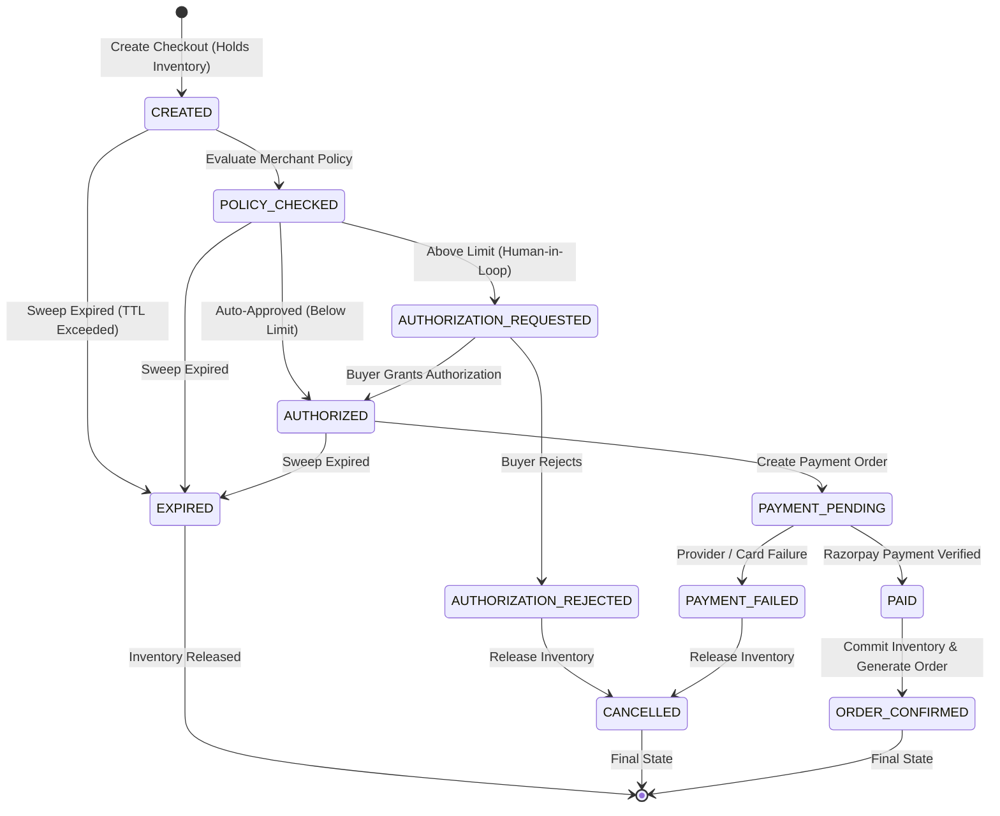

# AgentPay — State Machine & Transaction Lifecycle

## 1. Checkout State Machine

The AgentPay checkout state machine enforces strict, unidirectional, deterministic transitions for all commerce transactions. Every transition validates preconditions, revalidates price snapshot integrity, locks/releases inventory, and appends an immutable audit event.



---

## 2. States Specification

| State | Category | Description | Permitted Next Transitions |
|---|---|---|---|
| `CREATED` | Initial | Checkout created from an offer. Inventory held with conditional SQL lock. | `POLICY_CHECKED`, `CANCELLED`, `EXPIRED` |
| `POLICY_CHECKED` | In-Flight | Merchant rules & budget checks evaluated. | `AUTHORIZED`, `AUTHORIZATION_REQUESTED`, `CANCELLED`, `EXPIRED` |
| `AUTHORIZATION_REQUESTED` | In-Flight | Transaction amount exceeds auto-approval threshold; awaiting buyer PIN/signature. | `AUTHORIZED`, `AUTHORIZATION_REJECTED`, `EXPIRED` |
| `AUTHORIZED` | In-Flight | Authorization granted and valid mandate token bound. | `PAYMENT_PENDING`, `CANCELLED`, `EXPIRED` |
| `PAYMENT_PENDING` | In-Flight | Payment order created on Razorpay; awaiting settlement or webhook. | `PAID`, `PAYMENT_FAILED`, `EXPIRED` |
| `PAID` | Pre-Final | Webhook or checkout signature verified via constant-time HMAC-SHA256. | `ORDER_CONFIRMED` |
| `ORDER_CONFIRMED` | Terminal | Inventory committed, permanent `orders` record created. | None |
| `AUTHORIZATION_REJECTED` | Terminal | Buyer refused authorization. Held inventory released immediately. | None |
| `PAYMENT_FAILED` | Terminal | Payment declined or timed out. Held inventory released. | None |
| `CANCELLED` | Terminal | Explicit buyer or system cancellation. Held inventory released. | None |
| `EXPIRED` | Terminal | Checkout or authorization TTL passed without finalization. Background sweeper releases stock. | None |

---

## 3. Inventory Reservation Guarantees

1. **Reservation on Checkout**: Single atomic UPDATE guarded by version token and quantity:
   ```sql
   UPDATE inventory
      SET reserved_quantity = reserved_quantity + :qty,
          version = version + 1
    WHERE offer_id = :offer_id
      AND (available_quantity - reserved_quantity) >= :qty;
   ```
2. **Commit on Verification**: Both available and reserved quantities decremented upon `ORDER_CONFIRMED`.
3. **Automatic Release on Termination**: Transitions to `CANCELLED`, `EXPIRED`, `AUTHORIZATION_REJECTED`, or `PAYMENT_FAILED` release the held reservation idempotently.